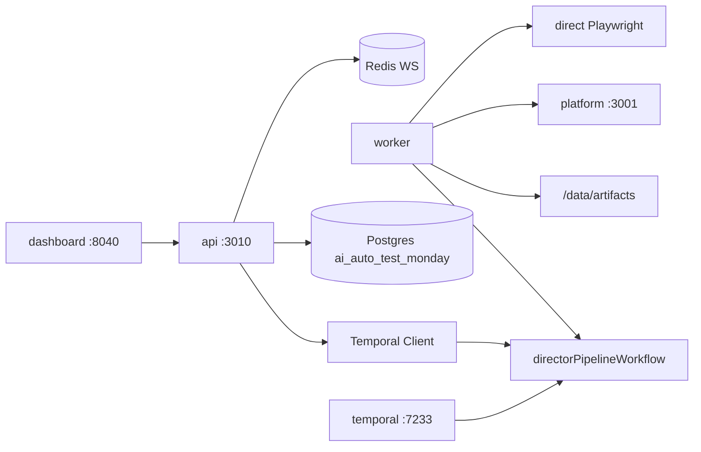

# ai-auto-test-monday 架构

## 设计共识

1. **独立 monorepo**，与 `ai-auto-test-platform` 解耦；生成与执行分层。
2. **Temporal** 编排 Director 流水线；Redis 用于 WS 进度广播。
3. **7 Agents**：6 个生成 + Continuity Lead 执行与失败分类。
4. **Git URL + local path override**；testid 注入默认 dry-run，opt-in apply。
5. **Artifact 工作台** UI：Gherkin 卡片、execution-report 预览、历史 Run。

## 系统图

## Temporal Workflow

**Workflow ID:** `pipeline-{projectId}-{runId}`  
**Task queue:** `director-pipeline`  
**Query:** `getPipelineProgress`

| 顺序 | Agent | 超时 | Artifact |
|------|-------|------|----------|
| 1 | Script Analyst | 10m | `component-registry.json` |
| 2 | Stage Manager | 10m | `testid-injections.json` (+ `apply-report.json`) |
| 3 | Blocking Coach | 10m | `locator-catalog.json` |
| 4 | Set Designer | 15m | `poms/*.ts` |
| 5 | Choreographer | 15m | `journeys.json`（**仅 LLM 生成**；失败则 pipeline 终止，需人工修复 LLM 后重跑） |
| 6 | Assistant Director | 20m | `tests/*.spec.ts` |
| 7 | Continuity Lead | 30m | `execution-report.json` |

Agent 7 在 `executeAfterGenerate !== false` 时运行（Dashboard 默认勾选）。

LLM（Agent 2/4/5/6）：经 Higress `chat/completions` **SSE 流式**接收，拼完整 JSON 后 Zod 校验；整次上限 `LLM_TIMEOUT` / `CHOREOGRAPHER_LLM_TIMEOUT`，相邻 chunk 空闲上限 `LLM_STREAM_CHUNK_TIMEOUT`（`LLM_STREAM_ENABLED=false` 可回退非流式）。

Artifact 根路径：`/data/artifacts/{projectId}/{runId}/`

## API 路由

| 方法 | 路径 | 说明 |
|------|------|------|
| GET | `/health` | DB / Temporal / Redis |
| GET/POST | `/api/projects` | 项目 CRUD |
| POST | `/api/projects/:id/clone` | 异步 clone |
| POST | `/api/pipeline/run` | 启动 workflow（body: `applyTestIds`, `executeAfterGenerate`, `executionMode`） |
| GET | `/api/pipeline/runs` | 历史 run 列表（`?projectId=`） |
| GET | `/api/pipeline/runs/:runId` | 进度 + DB |
| POST | `/api/pipeline/runs/:runId/cancel` | 取消 workflow |
| GET | `/api/pipeline/runs/:runId/artifacts/list` | artifact 列表（优先 `artifacts_index`） |
| GET | `/api/pipeline/runs/:runId/artifacts/:name` | 读 artifact |
| WS | `/ws?runId=` | Redis `pipeline:{runId}` 订阅 |

Platform 桥接（Agent 7）：`POST /api/projects/:id/features/import`（platform 侧）。

## Postgres Schema

- `projects` — git URL、local_path_override、target_url、`platform_project_id`
- `pipeline_runs` — status、current_agent、artifact_root、`execution_mode`、`execution_status`
- `artifacts_index` — worker 写入，API 读取索引

Migrations：`api/src/db/migrations/001_init.sql` … `003_execution.sql`

## Scanner / Apply

- **Scanner**：React（Babel）+ Vue（compiler-sfc）+ Angular（HTML）+ Svelte（compiler）
- **Stage Manager apply**：React codemod（Babel）+ 模板类框架 line-based inject
- Worker 对 sandbox 卷 **rw**（apply + materialize）

## Agent 7 执行流

1. `materializeArtifacts` → repo `tests/e2e/`
2. **auto/platform**：health check → register → import features → 串行 `POST /api/run`
3. **direct fallback**：`playwright-direct` subprocess
4. 输出 `execution-report.json`（Type A/B/C 分类）

## 里程碑

| 阶段 | 状态 |
|------|------|
| M0–M4 | ✅ 完成 |
| v2 Agent 7 + platform/direct | ✅ 完成 |
| v2.1 Type B 选择性重跑 Agent 1–6 | 待做 |

## Skill

`docker/skills/component-aware-web-automation/` — 7-Agent 方法论。

参考：[monday.com engineering blog](https://engineering.monday.com/every-playwright-needs-a-director-how-ai-agents-replace-dom-scraping-with-component-aware-static-analysis/)
