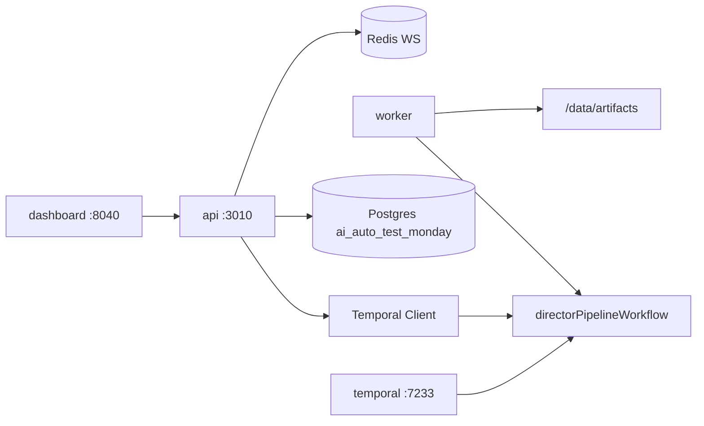
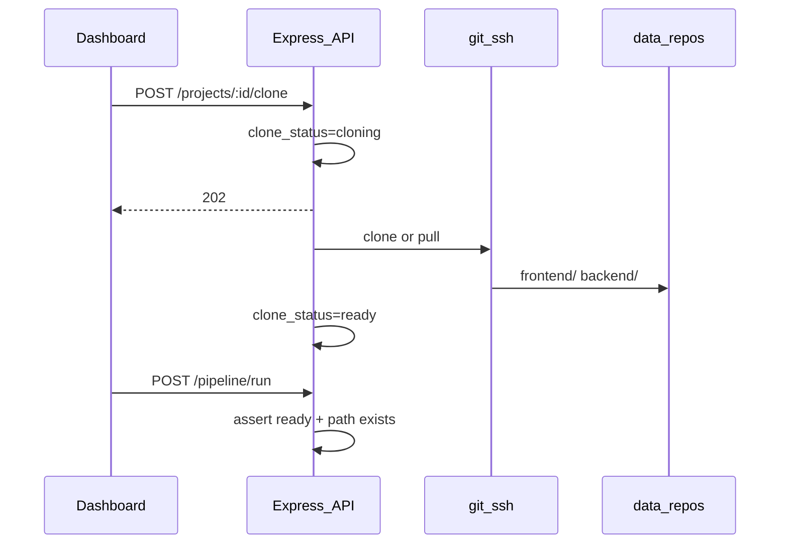

# ai-auto-test-monday 架构

## 设计共识（Grilling）

1. **独立 monorepo**，与 `ai-auto-test-platform` 解耦；生成与执行分层。
2. **Temporal** 编排 Director 流水线（非 Redis 队列）；Redis 仅用于 WS 进度广播。
3. **6 MVP Agents**（Phase 1 + Assistant Director）；Continuity Lead 留 v2。
4. **Git URL + local path override**；testid 注入 M0 为 dry-run。
5. **Artifact 工作台** UI；Gherkin 视图 M4。

## 系统图

## Temporal Workflow

**Workflow ID:** `pipeline-{projectId}-{runId}`  
**Task queue:** `director-pipeline`  
**Query:** `getPipelineProgress`

顺序执行 6 个 Activity（M0 stub）：

| 顺序 | Agent | Activity 超时 | M0 Artifact |
|------|-------|---------------|-------------|
| 1 | Script Analyst | 10m | `component-registry.json` |
| 2 | Stage Manager | 10m | `testid-injections.json` |
| 3 | Blocking Coach | 10m | `locator-catalog.json` |
| 4 | Set Designer | 15m | `poms/StubPage.ts` |
| 5 | Choreographer | 15m | `journeys.json` |
| 6 | Assistant Director | 20m | `tests/sample.spec.ts` |

Artifact 根路径：`/data/artifacts/{projectId}/{runId}/`

## API 路由（M0）

| 方法 | 路径 | 说明 |
|------|------|------|
| GET | `/health` | DB / Temporal / Redis 探测 |
| GET/POST | `/api/projects` | 项目列表 / 创建 |
| GET/PUT/DELETE | `/api/projects/:id` | 查看 / 更新 / 删除 |
| POST | `/api/projects/:id/clone` | 异步 clone，202 + 轮询状态 |
| POST | `/api/pipeline/run` | 启动 workflow |
| GET | `/api/pipeline/runs/:runId` | Query 进度 + DB |
| GET | `/api/pipeline/runs/:runId/artifacts/:name` | 读 artifact |
| WS | `/ws?runId=` | Redis `pipeline:{runId}` 订阅 |

## Postgres Schema

- `projects` — git URL、分支、local_path_override、target_url
- `pipeline_runs` — temporal_workflow_id、status、current_agent、artifact_root
- `artifacts_index` — 预留 M2+ 索引

Migration：`api/src/db/migrations/001_init.sql`

## Docker 服务

| Service | 端口 | 说明 |
|---------|------|------|
| temporal-postgresql | 内部 | Temporal 专用 PG |
| temporal | 7233 (内部) | temporalio/auto-setup |
| temporal-ui | **8088** | temporalio/ui |
| redis | 内部 | WS pub/sub |
| api | 3010 | Express |
| worker | — | Temporal worker |
| dashboard | 8040 | nginx + Vite 静态 |

Volumes：`docker/data/artifacts`、`docker/data/repos`、可选 external repos 只读挂载、`GIT_SSH_HOST_PATH` → `/root/.ssh:ro`。

## Clone 流程（M1）

- **Mount 型**（CRM）：`local_path_override` + 无 git URL → Clone 校验挂载路径存在即 `ready`
- **Git 型**：clone 到 `/data/repos/{id}/frontend|backend`；SSH 通过 api 容器挂载 `~/.ssh`
- Pipeline **不自动 clone**；`clone_status !== ready` 时返回 400

## 里程碑

| 阶段 | 交付 |
|------|------|
| **M0** | Stub pipeline、Compose、Dashboard、skill 拷贝 |
| **M1** | 项目 CRUD、git clone、clone 状态、Dashboard 项目管理 |
| **M2** | Agent 1–4：React Babel 扫描 + Higress LLM、真实 artifact |
| M3 | Agent 5–6 真实 journey/spec |
| M4 | Gherkin 卡片、artifact 预览增强 |
| v2 | continuityLead、Pi/e2e-test-env |

## Skill

`docker/skills/component-aware-web-automation/` — 从 `ai-auto-test-platform` 拷贝，定义 7-Agent 方法论（M0 仅实现前 6 个 stub）。

参考：[monday.com engineering blog](https://engineering.monday.com/every-playwright-needs-a-director-how-ai-agents-replace-dom-scraping-with-component-aware-static-analysis/)
