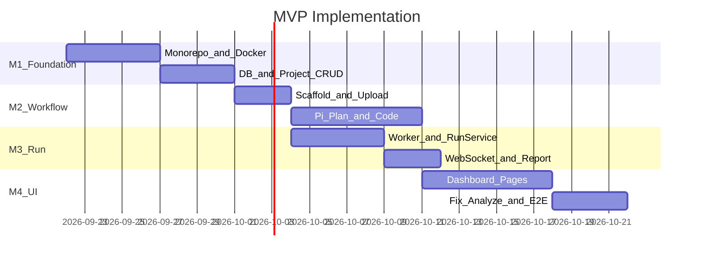
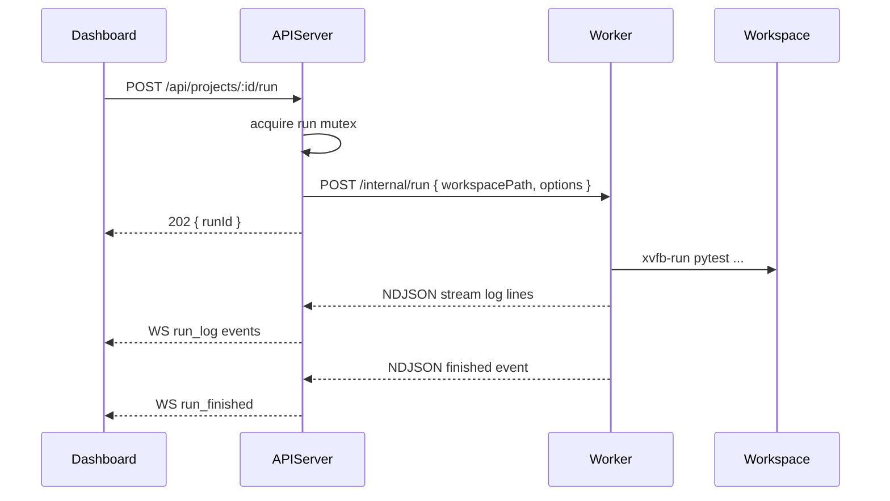

# ai-auto-test-playwright MVP 实施 PRD

| 项 | 内容 |
|---|---|
| 版本 | v0.1.0 |
| 日期 | 2026-09-19 |
| 状态 | **Implemented**（M1–M4 已完成） |
| 前置文档 | [PRD.md](./PRD.md)（产品需求） |
| 目标 | 将 MVP 拆解为可执行的开发里程碑、技术方案与验收清单 |

---

## 1. 文档关系

```
PRD.md                    ← 产品做什么（MVP 需求已落地）
PRD-MVP-Implementation.md  ← 怎么做 MVP（本文档，含完成状态与实现差异）
PRD-Phase2.md                    ← Phase 2 产品
PRD-Phase2-Implementation.md   ← Phase 2 实施
PRD-Phase3.md                    ← Phase 3 产品
PRD-Phase3-Implementation.md   ← Phase 3 实施
```

| 文档 | 读者 | 内容 |
|------|------|------|
| PRD.md | PM / 测试 / 开发 | 功能、API、数据模型、验收标准 |
| **PRD-MVP-Implementation.md** | 开发 | 里程碑、任务拆解、技术细节、联调顺序 |
| PRD-Phase2.md | PM / 开发 | 计划编辑、fix/apply、headless CI |
| PRD-Phase2-Implementation.md | 开发 | Phase 2 里程碑与 PR 清单 |
| PRD-Phase3.md | PM / 架构 | 队列、Web 录制、Git、RBAC |
| PRD-Phase3-Implementation.md | 开发 | Phase 3 队列/录制/Git/RBAC 实施 |

---

## 2. MVP 交付物清单

| # | 交付物 | 路径 | 完成标准 |
|---|--------|------|----------|
| D1 | Docker Compose 一键启动 | `docker/docker-compose.yml` | 4 服务 healthy |
| D2 | API Server | `server/` | 全部 REST 端点可用 |
| D3 | Docker Worker | `worker/` + `docker/worker/Dockerfile` | pytest 有头执行成功 |
| D4 | project-scaffold 模板 | `templates/project-scaffold/` | init-template 非破坏性复制 |
| D5 | Pi 集成 | `server/src/pi/` | plan/code/fix 三类 job 可跑 |
| D6 | 最小 Dashboard | `dashboard/` | 7 页面可走通主流程 |
| D7 | 数据库迁移 | `server/migrations/001_init.sql` | 5 张表（含 jobs） |
| D8 | E2E 演示脚本 | `scripts/demo-saucedemo.sh` | 自动化走通 MVP 验收 9 条 |

---

## 3. 里程碑与排期

总预估：**4–6 周**（1 人全职）；可并行部分标注 `[P]`。



### M1：基础架构（第 1–2 周）

**状态：已完成（v0.1.0，2026-09-19）**

**目标：** `docker compose up` 后 `/health` 返回 ok；项目 CRUD 可用。

| 任务 ID | 任务 | 产出 | 依赖 |
|---------|------|------|------|
| M1-01 | 初始化 monorepo（npm workspaces） | `package.json`、`server/package.json` | — |
| M1-02 | 复制/适配 platform 的 Express 骨架 | `server/src/index.ts` | M1-01 |
| M1-03 | PostgreSQL 迁移 001_init.sql | 5 表（含 jobs、stage_status） | M1-01 |
| M1-04 | ProjectRepository + ProjectService | CRUD | M1-03 |
| M1-05 | `createProjectsRouter` | `/api/projects` | M1-04 |
| M1-06 | docker-compose（server + postgres） | `docker/docker-compose.yml` | M1-02 |
| M1-07 | `/health` 含 db 检查 | — | M1-06 |
| M1-08 | `allowedRepoPrefixes` 路径校验 | config | M1-04 |

**M1 验收：**

```bash
curl -X POST http://localhost:3001/api/projects -H 'Content-Type: application/json' \
  -d '{"name":"Demo","baseUrl":"https://www.saucedemo.com","workspacePath":"/data/projects/demo"}'
# → 201 + project json

curl http://localhost:3001/health
# → database: up
```

---

### M2：工作流 — 模板、上传、Pi 生成（第 2–3 周）

**状态：已完成（v0.1.0，2026-09-19）**

**目标：** 上传 recorded.py → Pi 生成 plan → 确认 → Pi 生成 code。

| 任务 ID | 任务 | 产出 | 依赖 |
|---------|------|------|------|
| M2-01 | project-scaffold 模板文件 | `templates/project-scaffold/*` | M1 |
| M2-02 | ProjectTemplateService（copy-if-missing） | `server/src/services/project-template-service.ts` | M2-01 |
| M2-03 | `POST init-template` | route | M2-02 |
| M2-04 | 录制上传 multer + 校验 | `record/upload` | M1 |
| M2-05 | WorkflowStateRepository | stage 持久化 | M1-03 |
| M2-06 | 复制 PiRpcClient + event-parser | `server/src/pi/*` | M1 |
| M2-07 | 复制 skills 到 docker entrypoint | `docker/server/entrypoint.sh` | M1-06 |
| M2-08 | plan-prompt.ts + PlanService | `POST plan/generate` | M2-06 |
| M2-09 | code-prompt.ts + CodegenService | `POST code/generate` | M2-08 |
| M2-10 | `GET plan`、`GET files` | routes | M2-08 |
| M2-11 | JobRepository + `GET/POST /api/jobs/:id` | job 状态与 cancel | M1-03 |
| M2-12 | Pi job 失败 WS（plan_failed/code_failed） | ws-hub | M2-11 |

**M2 验收：**

1. init-template 后 `tests/` 目录存在 conftest.py、pytest.ini
2. 上传 `saucedemo.py` → workflow stage = recorded
3. plan/generate 后 `tests/plans/saucedemo-test-plan.md` 存在
4. code/generate 后 specs/pages/data 文件存在

---

### M3：Worker 执行与报告（第 3–4 周）

**状态：已完成（v0.1.0，2026-09-19）**

**目标：** API 触发 Worker 跑 pytest，产出 report.html + WebSocket 日志。

| 任务 ID | 任务 | 产出 | 依赖 |
|---------|------|------|------|
| M3-01 | Worker Dockerfile（Python + Xvfb） | `docker/worker/Dockerfile` | M1 |
| M3-02 | run-pytest.sh | `worker/run-pytest.sh` | M3-01 |
| M3-03 | Worker HTTP：`POST /internal/run` | `worker/server.py` 或 shell + curl | M3-02 |
| M3-04 | pytest-runner.ts 命令构建器 | `server/src/services/pytest-runner.ts` | M3-02 |
| M3-05 | RunService（mutex + 异步 + jobs 记录） | 参考 platform run-service.ts | M3-04 |
| M3-06 | RunRepository + runs 表写入（含 job_id） | — | M1-03 |
| M3-07 | WsHub + run 事件广播 | `server/src/ws/ws-hub.ts` | M3-05 |
| M3-08 | report/traces 静态文件服务 | GET report、GET traces | M3-05 |
| M3-09 | compose 加入 worker 服务 | docker-compose.yml | M3-03 |

**pytest 命令模板（pytest-runner.ts）：**

使用 Worker 镜像内固定 venv `/opt/venv/bin/pytest`，**不依赖** workspace `.venv`（见 [PRD.md ADR-008](./PRD.md#14-技术决策记录adr)）。

```typescript
const PYTEST = "/opt/venv/bin/pytest";

export function buildPytestCommand(options: {
  workspacePath: string;
  headed: boolean;
  slowmo: number;
  specFilter?: string;
}): string {
  const headed = options.headed ? "--headed" : "";
  const slowmo = options.slowmo > 0 ? `--slowmo ${options.slowmo}` : "";
  const spec = options.specFilter ?? "specs/";
  return [
    `cd ${options.workspacePath}/tests`,
    "&&",
    PYTEST, spec,
    headed, slowmo,
    "--tracing retain-on-failure",
    "--output test-results",
    "--html report.html --self-contained-html",
    "-v",
  ].filter(Boolean).join(" ");
}
```

**Worker 镜像要点：**

```dockerfile
# docker/worker/Dockerfile 核心
FROM python:3.14-slim
RUN apt-get update && apt-get install -y xvfb chromium-deps ...
RUN python -m venv /opt/venv \
    && /opt/venv/bin/pip install pytest pytest-playwright pytest-html playwright \
    && /opt/venv/bin/playwright install chromium
ENV PATH="/opt/venv/bin:$PATH"
COPY worker/ /app/worker/
ENV DISPLAY=:99
CMD ["xvfb-run", "-a", "python", "/app/worker/server.py"]
```

**M3 验收：**

```bash
curl -X POST http://localhost:3001/api/projects/:id/run \
  -H 'Content-Type: application/json' \
  -d '{"headed":true,"slowmo":600}'
# → runId

# WebSocket 收到 run_started → log* → run_finished { passed:15 }

curl http://localhost:3001/api/projects/:id/runs/:runId/report
# → HTML
```

---

### M4：Dashboard + Fix + 端到端（第 4–6 周）

**状态：已完成（v0.1.0，2026-09-19）**

**目标：** Web UI 走通全流程；fix/analyze 可用；demo 脚本通过。

| 任务 ID | 任务 | 产出 | 依赖 |
|---------|------|------|------|
| M4-01 | Dashboard 脚手架（Vite + React） | `dashboard/` | M1 |
| M4-02 | nginx 反代配置 | `docker/dashboard/nginx.conf` | M4-01 |
| M4-03 | 页面：Projects 列表/创建 | `/projects` | M4-01 |
| M4-04 | 页面：Record 上传 | `/projects/:id/record` | M2-04 |
| M4-05 | 页面：Plan 展示 + 确认按钮 | `/projects/:id/plan` | M2-08 |
| M4-06 | 页面：Run + WebSocket 终端 | `/projects/:id/run` | M3-07 |
| M4-07 | 页面：Report iframe | `/projects/:id/report/:runId` | M3-08 |
| M4-08 | 页面：Code 文件树 + 只读预览 | `/projects/:id/code` | M2-10 |
| M4-09 | fix-prompt.ts + FixService | `POST fix/analyze` | M2-06, M3 |
| M4-10 | 项目概览 workflow 状态机 UI | `/projects/:id` | M2-05 |
| M4-11 | scripts/demo-saucedemo.sh | E2E 演示（支持 `--mode debug\|ci`） | ALL |
| M4-12 | README.md 部署文档 | — | ALL |

**M4 验收：** 对照 [PRD.md 第 9 章](./PRD.md#9-mvp-验收标准) 9 条全部通过。

---

## 4. 技术方案细节

### 4.1 从 ai-auto-test-platform 复用的模块

| 源文件（platform） | 目标（playwright） | 改动 |
|-------------------|-------------------|------|
| `test-server/src/pi/rpc-client.ts` | `server/src/pi/rpc-client.ts` | 最小改动 |
| `test-server/src/pi/event-parser.ts` | `server/src/pi/event-parser.ts` | 复制 |
| `test-server/src/ws/ws-hub.ts` | `server/src/ws/ws-hub.ts` | 复制 |
| `test-server/src/services/run-service.ts` | `server/src/services/run-service.ts` | 替换 playwright-runner → pytest-runner |
| `test-server/src/services/project-template-service.ts` | 同名 | 换模板目录 |
| `docker/server/entrypoint.sh` | 同名 | 换 skills 路径 |
| `test-dashboard/src/hooks/useRunWebSocket.ts` | 同名 | 适配 message type |

### 4.2 新建模块（platform 无对应）

| 模块 | 职责 |
|------|------|
| `pytest-runner.ts` | 构建 pytest 命令，调用 Worker |
| `plan-service.ts` | 编排 Pi plan job |
| `codegen-service.ts` | 编排 Pi code job |
| `fix-service.ts` | 编排 Pi fix job |
| `workflow-state-repository.ts` | stage + stage_status 读写 |
| `job-repository.ts` | jobs 表 CRUD、活跃 job 查询 |
| `worker/server.py` | 接收 run job，exec run-pytest.sh |

### 4.3 Server ↔ Worker 通信（MVP）



Worker MVP 实现选项：

| 选项 | 复杂度 | 推荐 |
|------|--------|------|
| A. Worker 独立 Python HTTP 服务 | 中 | **MVP 推荐** |
| B. server docker exec worker | 低 | 开发调试用 |
| C. Redis + Celery 队列 | 高 | Phase 3 |

### 4.4 Pi Job 异步模式

MVP 与 platform audit job 类似，**统一使用 `jobs` 表**（见 [PRD.md §6.3](./PRD.md#63-迁移脚本mvp)）：

1. `POST plan/generate` → 创建 `jobs` 记录（type=plan）→ 后台 spawn Pi → 立即 202 `{ jobId }`
2. Pi 完成 → 写 plan 文件 → 更新 workflow stage + `stage_status=idle` → WS `plan_ready`
3. Pi 失败/超时 → `jobs.status=failed` → WS `plan_failed`；HTTP `GET /api/jobs/:jobId`
4. 用户可 `POST /api/jobs/:jobId/cancel` 取消 pending/running 的 Pi job
5. 前端轮询 `GET /api/jobs/:jobId` 或听 WS

**jobs.type：** `plan` | `code` | `fix` | `run`（run job 在 M3 接入，与 runs 表关联）

### 4.5 环境变量（docker/.env.example）

```bash
COMPOSE_PROJECT_NAME=ai-auto-test-playwright
SERVER_PORT=3001
DASHBOARD_PORT=8040
PORT=3001

POSTGRES_HOST=postgres
POSTGRES_PORT=5432
POSTGRES_DB=ai_auto_test_playwright
POSTGRES_USER=postgres
POSTGRES_PASSWORD=postgres

WORKER_URL=http://worker:8081
ALLOWED_REPO_PREFIXES=/data/projects
PROJECTS_DATA_PATH=./data/projects

# Pi（参考 ai-auto-test-platform）
PI_CLI_PATH=pi
PI_PROVIDER=...
PI_MODEL=...
HIGRESS_BASE_URL=...
HIGRESS_API_KEY=...

RUN_TIMEOUT_MS=600000
```

---

## 5. 目录结构（MVP 完成后）

```
ai-auto-test-playwright/
├── PRD.md
├── PRD-MVP-Implementation.md    # 本文档
├── README.md
├── package.json                 # npm workspaces
├── docker/
│   ├── docker-compose.yml
│   ├── .env.example
│   ├── server/Dockerfile
│   ├── worker/Dockerfile
│   └── dashboard/
│       ├── Dockerfile
│       └── nginx.conf
├── server/
│   ├── package.json
│   ├── migrations/001_init.sql
│   └── src/
│       ├── index.ts
│       ├── config.ts
│       ├── routes/
│       ├── services/
│       ├── repositories/
│       ├── pi/
│       └── ws/
├── worker/
│   ├── server.py
│   ├── run-pytest.sh
│   └── healthcheck.sh
├── dashboard/
│   └── src/
│       ├── pages/
│       └── hooks/
├── templates/project-scaffold/
├── skills/                      # → ../skills/playwright-e2e/cn
└── scripts/
    └── demo-saucedemo.sh
```

---

## 6. 联调顺序

按以下顺序集成，每步可独立验证（**MVP 已全部走通**）：

```
1. docker-compose up -d postgres server worker dashboard   # 或 docker compose up
2. POST /api/projects + init-template
3. POST record/upload（用仓库 tests/recorded/saucedemo.py）
4. [需 Pi] POST plan/generate → GET plan
5. [需 Pi] POST code/generate → GET files
6. POST run → WS 日志 → GET report
7. [需 Pi] POST fix/analyze（先故意失败一条）
8. open http://localhost:8040/projects → UI 全流程
```

**一键验收：**

```bash
cd docker && docker-compose up --build -d
curl http://localhost:8040/health
SEED_TESTS=always MODE=ci ../scripts/demo-saucedemo.sh
```

**无 Pi 环境的降级验证：**

- `SEED_TESTS=always` 或手动复制根目录 `tests/` 到 project workspace → 跳过步骤 4–5
- 仅验证 M3 run + report + M4 UI

> **注：** 部分环境无 `docker compose` 插件，请使用 `docker-compose`（带连字符）。

---

## 7. MVP 完成说明 / 实现差异

Agent 施工时勿将下列项误判为「未实现 bug」。

| PRD / 任务 | 实现状态 | 备注 |
|------------|----------|------|
| [PRD §9 全部 9 条](PRD.md#9-mvp-验收标准) | 已通过 | demo 脚本 + 四服务 healthy |
| M4-04 Record codegen 指引 | **已完成** | RecordPage 展示 `npx playwright codegen` 命令 + 复制按钮 |
| M4-10 Tab 按 stage 禁用 | **已完成** | `useWorkflow` + Layout Tab 按 stage/stageStatus 门控 |
| PRD §9-7 headed + slowmo | **部分** | Worker 内 Xvfb 执行，**宿主机不弹浏览器**；**无 Run 期 VNC**（预览见 [PRD-Phase4.md](./PRD-Phase4.md)） |
| PRD §8 性能 CI <3min | **已完成** | headless 不再包 xvfb-run；`proc.wait()` 超时 + flush 修复 run 状态延迟 |
| PRD §3.2 upload 校验 playwright import | **已完成** | `uploadRecording` 校验 `from playwright` / `import playwright` |
| fix/analyze | 已完成 | 只读建议；依赖 `DASHSCOPE_API_KEY`（`.env.local`） |
| Web 录制 noVNC | **已完成** | Phase 3；**不含** Run 执行预览（Phase 4） |

**与 PRD §9 验收对照：**

| # | 验收项 | 状态 |
|---|--------|------|
| 1 | 四服务 healthy | ✅ |
| 2 | Web 创建项目 | ✅ |
| 3 | init-template | ✅ |
| 4 | 上传 saucedemo 录制 | ✅ |
| 5 | Pi 生成计划 + UI 展示 | ✅（需 API Key） |
| 6 | 确认后生成代码 | ✅（需 API Key） |
| 7 | headed slowmo 15 passed | ✅（容器内；见实现差异） |
| 8 | UI 打开 HTML 报告 | ✅ |
| 9 | fix/analyze 结构化建议 | ✅（需失败 run + Pi） |

---

## 8. 测试策略

| 层级 | 范围 | 工具 |
|------|------|------|
| 单元测试 | ProjectService、pytest-runner、路径校验 | vitest |
| API 集成 | projects CRUD、upload、health | supertest + testcontainers postgres |
| Worker 集成 | run-pytest.sh 对样例 tests/ | shell + docker |
| E2E | demo-saucedemo.sh 全流程 | bash + curl + ws client |
| 人工 | Dashboard 6 页面 | 浏览器 |

---

## 9. 风险与缓解（实施层）

| 风险 | 缓解 |
|------|------|
| Pi 生成代码质量不稳定 | prompt 注入完整 skill + 样例 tests/ 作 reference |
| Worker 有头模式在 CI 无 DISPLAY | Xvfb + xvfb-run；文档说明 macOS 本地 Worker 备选 |
| 大文件上传 | 限制 1MB；仅 .py |
| run mutex 阻塞 | UI 显示「运行中」；409 友好提示 |
| platform 代码 fork 漂移 | 复制时加注释标注源 commit |

---

## 10. 下一步：Phase 2

MVP（M1–M4）已完成。开 Phase 2 前阅读：

- 产品：[PRD-Phase2.md](./PRD-Phase2.md)
- 实施：[PRD-Phase2-Implementation.md](./PRD-Phase2-Implementation.md)

Phase 2 重点：计划在线编辑、fix/apply 闭环、CI preset、run 对比。

---

## 附录：demo-saucedemo.sh 大纲

```bash
#!/usr/bin/env bash
set -euo pipefail
BASE=${BASE:-http://localhost:3001}
MODE=${MODE:-debug}  # debug: headed+slowmo600 | ci: headless+fast

if [ "$MODE" = "ci" ]; then
  RUN_BODY='{"headed":false,"slowmo":0}'
else
  RUN_BODY='{"headed":true,"slowmo":600}'
fi

# 1. create project
PROJECT=$(curl -s -X POST "$BASE/api/projects" -H 'Content-Type: application/json' \
  -d '{"name":"SauceDemo","baseUrl":"https://www.saucedemo.com","workspacePath":"/data/projects/saucedemo"}' \
  | jq -r '.data.id')

# 2. init-template
curl -s -X POST "$BASE/api/projects/$PROJECT/init-template"

# 3. upload recorded
curl -s -X POST "$BASE/api/projects/$PROJECT/record/upload" \
  -F "file=@../tests/recorded/saucedemo.py" -F "moduleName=saucedemo"

# 4–5. plan + code (或跳过，预置 tests/)
# 6. run
RUN=$(curl -s -X POST "$BASE/api/projects/$PROJECT/run" \
  -H 'Content-Type: application/json' -d "$RUN_BODY" | jq -r '.data.runId')

# 7. poll until finished, assert passed=15
# Usage: MODE=ci ./scripts/demo-saucedemo.sh   # 快速回归
#        MODE=debug ./scripts/demo-saucedemo.sh  # MVP 默认验收
```
