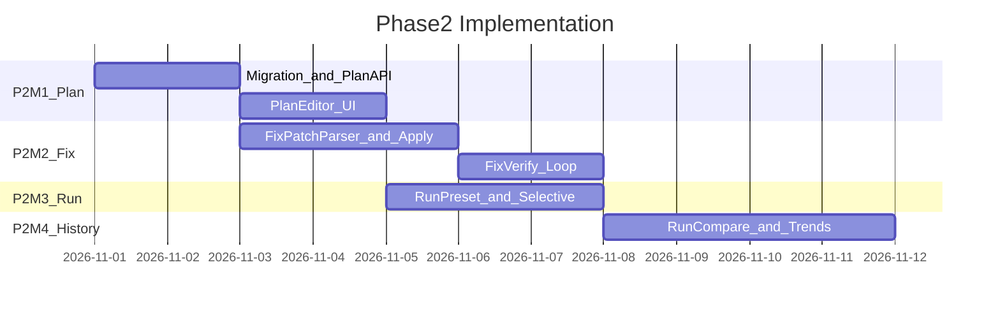

# ai-auto-test-playwright Phase 2 实施 PRD

| 项 | 内容 |
|---|---|
| 版本 | v0.1 |
| 日期 | 2026-09-19 |
| 状态 | Draft |
| 前置文档 | [PRD-Phase2.md](./PRD-Phase2.md)（产品需求）、[PRD-MVP-Implementation.md](./PRD-MVP-Implementation.md) |
| 前置条件 | MVP 验收通过（[PRD.md 第 9 章](./PRD.md#9-mvp-验收标准)） |
| 目标 | 将 Phase 2 拆解为可执行的里程碑、技术方案与验收清单 |

---

## 1. 文档关系

```
PRD.md                         ← MVP 产品需求
PRD-MVP-Implementation.md      ← MVP 怎么做
PRD-Phase2.md                  ← Phase 2 做什么
PRD-Phase2-Implementation.md   ← Phase 2 怎么做（本文档）
PRD-Phase3.md                  ← Phase 3 产品需求
PRD-Phase3-Implementation.md   ← Phase 3 怎么做
```

| 文档 | 读者 | 内容 |
|------|------|------|
| PRD-Phase2.md | PM / 测试 / 开发 | 功能、API、数据模型、验收标准 |
| **PRD-Phase2-Implementation.md** | 开发 | 里程碑、任务 ID、代码模块、联调顺序 |

---

## 2. Phase 2 交付物清单

| # | 交付物 | 路径 / 模块 | 完成标准 |
|---|--------|-------------|----------|
| D1 | DB 迁移 002 | `server/migrations/002_phase2.sql` | plan_versions、fix_iterations、runs 扩展 |
| D2 | Plan 版本 API | `server/src/routes/plan.ts` | PUT/GET versions/diff |
| D3 | Plan 编辑器 UI | `dashboard/src/pages/PlanEditor.tsx` | 编辑、保存、diff |
| D4 | Fix patch 解析 | `server/src/services/fix-patch-parser.ts` | Pi JSON + unified diff |
| D5 | Fix apply 服务 | `server/src/services/fix-apply-service.ts` | 路径校验 + backup + patch |
| D6 | Fix 闭环 UI | `dashboard/src/pages/FixReview.tsx` | Diff + apply + verify WS |
| D7 | Run preset | `server/src/services/pytest-runner.ts` | debug/ci/custom |
| D8 | Run 对比 API | `server/src/services/run-compare-service.ts` | TC 级 compare |
| D9 | History 趋势 UI | `dashboard/src/pages/History.tsx` | 7 日折线 + compare |
| D10 | Phase 2 E2E 脚本 | `scripts/demo-phase2.sh` | 10 条验收自动化 |

---

## 3. 里程碑与排期

总预估：**2–3 周**（MVP 已上线，1 人全职）。



---

### P2-M1：计划版本（4 天）

**状态：已完成（v0.2.0-p2m1，2026-09-19）**

**目标：** 用户可在 Web 编辑 plan，保存版本，查看 diff，基于指定版本 code/generate。

| 任务 ID | 任务 | 产出 | 依赖 |
|---------|------|------|------|
| P2-M1-01 | 迁移 `002_phase2.sql` | plan_versions 表 | MVP |
| P2-M1-02 | PlanVersionRepository | CRUD + 递增 version_number | P2-M1-01 |
| P2-M1-03 | plan/generate 完成后写 v1（source=ai） | PlanService 扩展 | P2-M1-02 |
| P2-M1-04 | `PUT /api/projects/:id/plan` | 保存 user 版本 | P2-M1-02 |
| P2-M1-05 | `GET plan/versions`、`GET versions/:id` | routes | P2-M1-02 |
| P2-M1-06 | `GET plan/diff?v1=&v2=` | 使用 `diff` npm 包 | P2-M1-05 |
| P2-M1-07 | TC 编号校验 | 保存前 regex `TC-\d+` 至少 1 处 | P2-M1-04 |
| P2-M1-08 | code/generate 接受 planVersionId | CodegenService | P2-M1-02 |
| P2-M1-09 | PlanEditor 页面（Monaco/MD Editor） | dashboard | P2-M1-05 |
| P2-M1-10 | 版本侧栏 + diff 模态框 | dashboard | P2-M1-06 |

**PlanVersionRepository 核心逻辑：**

```typescript
async saveVersion(input: {
  projectId: string;
  moduleName: string;
  content: string;
  source: "ai" | "user";
  baseVersionId?: string;
  message?: string;
}): Promise<PlanVersion> {
  const latest = await this.getLatest(input.projectId, input.moduleName);
  const versionNumber = (latest?.versionNumber ?? 0) + 1;
  // insert DB（权威） + sync tests/plans/<module>-test-plan.md on disk（Pi 读取副本）
}
```

**Plan 权威源：** DB `plan_versions.content` 为准；磁盘 markdown 在 save/generate 时同步；`code/generate` 从 DB 读 `planVersionId` 内容。

**P2-M1 验收：**

```bash
# 生成 plan 后应有 v1
curl http://localhost:3001/api/projects/$PID/plan/versions
# → versionNumber: 1, source: ai

# 保存编辑
curl -X PUT http://localhost:3001/api/projects/$PID/plan \
  -H 'Content-Type: application/json' \
  -d '{"content":"# ... TC-016 ...","baseVersionId":"...","message":"add TC-016"}'
# → versionNumber: 2

curl "http://localhost:3001/api/projects/$PID/plan/diff?v1=...&v2=..."
# → unified diff text
```

---

### P2-M2：fix apply 闭环（5 天）

**状态：已完成（v0.2.0-p2m2，2026-09-19）**

**目标：** analyze 返回 patches → UI Diff → apply → 自动 verify 失败用例，最多 3 轮。

| 任务 ID | 任务 | 产出 | 依赖 |
|---------|------|------|------|
| P2-M2-01 | 迁移 fix_iterations 表 | SQL | P2-M1-01 |
| P2-M2-02 | fix-prompt.ts 增强 | 要求 Pi 输出 patches JSON | MVP Pi |
| P2-M2-03 | fix-patch-parser.ts | 校验 JSON schema + diff 格式 | P2-M2-02 |
| P2-M2-04 | fix-apply-service.ts | 路径白名单 + backup + `applyPatch`（`diff` npm 包） | P2-M2-03 |
| P2-M2-05 | `POST fix/apply` | route | P2-M2-04 |
| P2-M2-06 | `POST fix/verify` | 仅跑 failed nodeIds | P2-M2-05 |
| P2-M2-07 | fix 迭代计数 + 3 轮上限 | FixService | P2-M2-01 |
| P2-M2-08 | runs.failed_node_ids 写入 | RunService 扩展 | MVP M3 |
| P2-M2-09 | FixReview 页面 | Diff 组件 + apply 按钮 | P2-M2-05 |
| P2-M2-10 | autoVerify 串联 apply→verify | FixService | P2-M2-06 |
| P2-M2-11 | `GET fix/history?runId=` | route | P2-M2-07 |

**Patch 路径安全（fix-apply-service.ts）：**

```typescript
function assertSafeTestPath(workspacePath: string, relativeFile: string): string {
  const normalized = path.normalize(relativeFile).replace(/^(\.\.(\/|\\|$))+/, "");
  if (!normalized.startsWith("tests/")) {
    throw new Error("Patch path must be under tests/");
  }
  const abs = path.join(workspacePath, normalized);
  if (!abs.startsWith(path.join(workspacePath, "tests"))) {
    throw new Error("Path traversal blocked");
  }
  return abs;
}
```

**Backup 策略：** apply 前复制目标文件到 `tests/.backup/<timestamp>/` 同路径。

**Patch 应用库：** 使用 [`diff`](https://www.npmjs.com/package/diff) 包的 `applyPatch(unifiedDiff, { fuzzFactor: 2 })`；plan diff 与 fix apply 共用该依赖。单测需覆盖：合法 hunk、路径越界拒绝、apply 失败回滚 backup。

**P2-M2 验收：**

1. 故意让 TC-007 失败 → analyze 返回 `patches[]`
2. UI 展示 unified diff
3. apply patch → `product_detail_page.py` 已改
4. autoVerify 单用例通过
5. 第 4 次 fix 请求返回 422 `FIX_ITERATION_LIMIT`

---

### P2-M3：Run preset 与精准执行（3 天）

**状态：已完成（v0.2.0-p2m3，2026-09-19）**

**目标：** debug/ci preset、单用例执行、失败重跑。

| 任务 ID | 任务 | 产出 | 依赖 |
|---------|------|------|------|
| P2-M3-01 | runs 表加 preset、failed_node_ids、parent_run_id | migration | P2-M1-01 |
| P2-M3-02 | PRESETS 常量 | debug/ci 参数映射 | — |
| P2-M3-03 | pytest-runner 支持 preset 解析 | 扩展 buildPytestCommand | MVP |
| P2-M3-04 | specFilter 透传 Worker | run payload | P2-M3-03 |
| P2-M3-05 | rerunFailedOnly 逻辑 | 读 parent run failed_node_ids | P2-M3-01 |
| P2-M3-06 | pytest 失败时解析 nodeId | RunService 收尾 | MVP |
| P2-M3-07 | Run 页面 preset 切换 | dashboard | P2-M3-02 |
| P2-M3-08 | TC 选择器（从 plan 解析 TC 列表） | dashboard | P2-M1 |
| P2-M3-09 | 「仅重跑失败」按钮 | dashboard | P2-M3-05 |
| P2-M3-10 | MVP 兼容：无 preset → debug | RunService | P2-M3-02 |

**Preset 映射：**

```typescript
export const RUN_PRESETS = {
  debug: { headed: true, slowmo: 600 },
  ci:    { headed: false, slowmo: 0 },
} as const;

export function resolveRunOptions(body: RunRequestBody) {
  if (body.preset && body.preset !== "custom") {
    return { ...RUN_PRESETS[body.preset], preset: body.preset };
  }
  return {
    headed: body.headed ?? true,
    slowmo: body.slowmo ?? 600,
    preset: "custom" as const,
  };
}
```

**rerunFailedOnly pytest 命令：**

```bash
pytest specs/test_inventory.py::TestInventory::test_tc007_... \
       specs/test_login.py::TestLogin::test_tc003_... -v ...
# 多个 nodeId 空格拼接
```

**P2-M3 验收：**

1. ci preset 15 用例 < 180s
2. debug preset 行为与 MVP 一致
3. 选择 TC-001 仅跑 1 条
4. 失败后 rerunFailedOnly 仅跑失败列表

---

### P2-M4：历史对比与趋势（4 天）

**状态：已完成（v0.2.0-p2m4，2026-09-19）**

**目标：** 两次 run TC 级对比；项目概览 7 日通过率趋势。

| 任务 ID | 任务 | 产出 | 依赖 |
|---------|------|------|------|
| P2-M4-01 | run-compare-service.ts | TC 级 diff 算法 | P2-M3-06 |
| P2-M4-02 | `GET runs/compare?runA=&runB=` | route | P2-M4-01 |
| P2-M4-03 | TC 映射 helper | 从 nodeId 提取 TC-NNN | — |
| P2-M4-04 | History 页面 | run 列表筛选 | MVP |
| P2-M4-05 | Compare 选择器 UI | 双选 run | P2-M4-02 |
| P2-M4-06 | 趋势 API `GET projects/:id/stats/trend?days=7` | SQL aggregate | MVP runs |
| P2-M4-07 | 概览页折线图 | recharts 或 chart.js | P2-M4-06 |
| P2-M4-08 | Report 页「分析修复」入口 | link → FixReview | P2-M2 |
| P2-M4-09 | scripts/demo-phase2.sh | E2E | ALL |

**Compare 算法概要：**

```typescript
// 输入：runA.failed_node_ids, runA.passed TC set；runB 同理
// 输出：newFailures, fixed, stillFailing, newlyPassing
function compareRuns(runA: Run, runB: Run): RunCompareResult {
  const tc = (nodeId: string) => extractTcNumber(nodeId); // TC-007
  // set operations on TC ids
}
```

**P2-M4 验收：** 对照 [PRD-Phase2.md 第 7 章](./PRD-Phase2.md#7-验收标准) 10 条全部通过。

---

## 4. 模块变更地图（相对 MVP）

| MVP 模块 | Phase 2 变更 |
|----------|--------------|
| `server/src/services/run-service.ts` | preset、failed_node_ids、rerunFailedOnly |
| `server/src/services/pytest-runner.ts` | preset 映射、多 nodeId |
| `server/src/services/fix-service.ts` | patches 解析、apply、verify 循环 |
| `server/src/services/plan-service.ts` | 版本化、写 v1 |
| `server/src/services/codegen-service.ts` | planVersionId 参数 |
| `server/src/routes/plan.ts` | **新建** |
| `server/src/routes/fix.ts` | 扩展 apply/verify/history |
| `dashboard/src/pages/PlanEditor.tsx` | **新建** |
| `dashboard/src/pages/FixReview.tsx` | **新建** |
| `dashboard/src/pages/History.tsx` | **新建** |

---

## 5. 联调顺序

```
1. 跑迁移 002
2. plan/generate → 确认 v1 自动创建
3. PUT plan 保存 v2 → GET diff
4. code/generate(planVersionId=v2)
5. ci preset 全量 run → 记录 failed_node_ids
6. analyze → patches → apply → verify
7. rerunFailedOnly
8. compare 两次 run
9. UI 全流程 + demo-phase2.sh
```

**降级测试（无 Pi）：**

- 手动编辑 plan 文件 + PUT plan 保存版本
- 手动构造 patches JSON 测试 apply
- 不依赖 Pi 的部分可先行开发（P2-M3、P2-M4）

---

## 6. 测试策略

| 层级 | 范围 | 工具 |
|------|------|------|
| 单元 | fix-patch-parser、path 校验、compare 算法、preset 解析 | vitest |
| 集成 | plan versions CRUD、fix apply 写盘 | supertest + temp dir |
| E2E | demo-phase2.sh | bash + curl |
| 人工 | PlanEditor diff、FixReview UI | 浏览器 |

**关键单测用例：**

```typescript
it("blocks patch outside tests/", () => {
  expect(() => assertSafeTestPath("/ws", "../etc/passwd")).toThrow();
});

it("compareRuns detects fixed TC", () => {
  const r = compareRuns(
    { failedNodeIds: ["...::test_tc007_..."] , ...},
    { failedNodeIds: [], ...},
  );
  expect(r.fixed).toContain("TC-007");
});
```

---

## 7. 环境变量（Phase 2 新增）

| 变量 | 默认 | 说明 |
|------|------|------|
| `PLAN_MAX_VERSIONS` | `50` | 每 module 版本上限 |
| `FIX_MAX_ITERATIONS` | `3` | fix 循环上限 |
| `RUN_CI_SLOWMO` | `0` | ci preset slowmo |
| `RUN_DEBUG_SLOWMO` | `600` | debug preset slowmo |

---

## 8. 风险与缓解（实施层）

| 风险 | 缓解 |
|------|------|
| Pi patches 格式漂移 | JSON schema + 单测 fixture；失败降级纯 Markdown |
| apply 破坏 workspace | backup + 单测路径校验 |
| diff 大 plan 性能差 | 客户端 diff；>500KB 警告 |
| TC 提取与命名不一致 | 生成 code 时强制 test_tcNNN 约定 |

---

## 9. PR 清单（建议顺序）

| PR | 范围 | 预估 |
|----|------|------|
| PR-1 | migration 002 + PlanVersionRepository + plan API | 2d |
| PR-2 | PlanEditor UI + diff | 2d |
| PR-3 | fix-patch-parser + apply + backup | 2d |
| PR-4 | fix verify loop + FixReview UI | 3d |
| PR-5 | run preset + selective + rerunFailedOnly | 3d |
| PR-6 | run compare + trend + History UI | 4d |
| PR-7 | demo-phase2.sh + README 更新 | 1d |

---

## 10. Phase 2 完成定义（Definition of Done）

- [x] [PRD-Phase2.md 第 7 章](./PRD-Phase2.md#7-验收标准) 10 条验收通过
- [x] `scripts/demo-phase2.sh` CI 绿
- [x] MVP API 向后兼容（无 preset = debug）
- [x] README Phase 2 章节更新
- [x] 无 P0/P1 open bug

---

## 附录 A：demo-phase2.sh 大纲

```bash
#!/usr/bin/env bash
# 前置：MVP demo 已 create project + 有 code
# 1. PUT plan v2 with extra TC
# 2. code/generate planVersionId=v2
# 3. ci run → assert duration < 180s
# 4. inject bad locator → run fail
# 5. fix/analyze → fix/apply → verify pass
# 6. compare two runs
# 7. GET trend 7d
```

---

## 附录 B：002_phase2.sql 概要

```sql
CREATE TABLE plan_versions (...);
CREATE TABLE fix_iterations (...);
ALTER TABLE runs ADD COLUMN preset TEXT, ADD COLUMN failed_node_ids JSONB,
  ADD COLUMN parent_run_id UUID REFERENCES runs(id);
ALTER TABLE fix_suggestions ADD COLUMN patches JSONB, ADD COLUMN iteration INT;
CREATE INDEX idx_plan_versions_project ON plan_versions(project_id, module_name);
CREATE INDEX idx_runs_project_started ON runs(project_id, started_at DESC);
```
