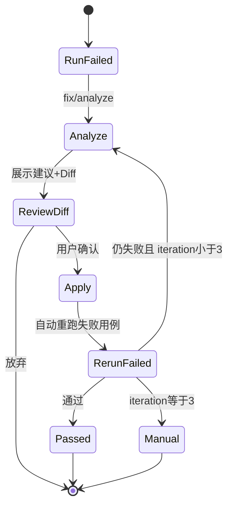

# ai-auto-test-playwright Phase 2 产品需求文档

| 项 | 内容 |
|---|---|
| 版本 | v0.1 |
| 日期 | 2026-09-19 |
| 状态 | Draft |
| 前置文档 | [PRD.md](./PRD.md)（MVP）、[PRD-MVP-Implementation.md](./PRD-MVP-Implementation.md) |
| 前置条件 | MVP 验收通过（[PRD.md 第 9 章](./PRD.md#9-mvp-验收标准)） |

---

## 1. 背景与目标

### 1.1 MVP 遗留痛点

MVP 已打通「上传录制 → AI 计划 → 确认 → 生成代码 → 执行报告 → fix 只读建议」主链路，但存在明显短板：

| 痛点 | MVP 现状 | Phase 2 目标 |
|------|----------|--------------|
| 用例计划不可改 | 只能看 Markdown，确认或重来 | 在线编辑、版本对比、增量再生成 |
| fix 只读 | AI 给建议，人工去 IDE 改 | Web 内 Diff 预览 + 确认后自动 patch |
| 执行模式单一 | 默认 headed + slowmo，耗时长 | 支持 headless CI 模式，快速回归 |
| 运行粒度粗 | 只能全量 `specs/` | 单文件 / 单用例 / 仅失败重跑 |
| 历史不可比 | 多次 run 结果散落 | 两次 run 对比、趋势概览 |
| 修复无闭环 | analyze 后无自动验证 | apply → 重跑失败用例 → 最多 3 轮 |

### 1.2 Phase 2 目标

在 **不改变 MVP 架构（API + Docker Worker + Pi RPC）** 的前提下，提升：

1. **编辑体验** — 计划可改、修复可应用
2. **执行效率** — CI 无头模式、精准重跑
3. **可观测性** — 运行历史对比、fix 迭代记录

### 1.3 范围

| 包含 | 不包含（留 Phase 3） |
|------|---------------------|
| 计划在线编辑 + 版本历史 | Web 内嵌 codegen / noVNC |
| fix/apply + Diff 确认 + 自动重验证 | Redis 多 Worker 队列 |
| headless / headed 模式切换 | Git 集成 |
| 单用例 / 失败重跑 | 多租户 RBAC |
| 运行历史对比 | CI 插件（Jenkins/GitHub Actions） |

### 1.4 成功指标

| 指标 | 目标 |
|------|------|
| 计划修改后重新生成代码成功率 | >= 80%（无需回 IDE 手改） |
| fix apply 后单用例验证通过率 | >= 70%（首轮） |
| headless 全量 15 用例耗时 | < 3 分钟 |
| 用户从失败到 apply+验证完成 | < 5 分钟（单条用例） |

---

## 2. 功能需求

### 2.1 用例计划在线编辑

**用户故事：** 作为测试工程师，我需要在 Web 上修改 AI 生成的用例计划（增删 TC、改断言描述），再基于修改后的计划重新生成代码。

#### 功能点

| ID | 功能 | 说明 |
|----|------|------|
| P2-PLAN-01 | Markdown 编辑器 | 支持编辑 `tests/plans/<module>-test-plan.md` |
| P2-PLAN-02 | 版本保存 | 每次保存产生新版本，不覆盖历史 |
| P2-PLAN-03 | 版本对比 | 任意两版 diff（侧栏或 unified diff） |
| P2-PLAN-04 | 从 AI 版本恢复 | 一键回滚到最近一次 Pi 生成版本 |
| P2-PLAN-05 | 增量再生成 | `code/generate` 支持 `planVersion` 参数，基于指定版本生成 |
| P2-PLAN-06 | 计划校验 | 保存前检查必须含 TC 编号列表（正则 `TC-\d+`） |

#### 数据权威源（Phase 2）

- **`plan_versions` 表（DB）为权威**；`tests/plans/<module>-test-plan.md` 为 Pi/codegen 读取的**同步副本**
- `PUT plan` 保存时：写 DB → sync 到磁盘 markdown
- `code/generate(planVersionId)`：从 DB 读取指定版本内容，写入临时文件或直接注入 Pi prompt
- `GET plan`：返回 latest version 元数据 + content（来自 DB）

#### 工作流变更

```
MVP:  plan(generate) → 只读 → confirm → code(generate)

P2:   plan(generate) → 编辑 → plan(save) → confirm → code(generate, planVersion)
                ↑__________| 版本历史 / diff
```

#### UI：`/projects/:id/plan`

- 左侧：版本列表（v1 AI 生成、v2 用户编辑…）
- 中间：Markdown 编辑器（推荐 `@uiw/react-md-editor` 或 Monaco）
- 右侧：预览渲染
- 底部：「保存新版本」「与 vN 对比」「确认并生成代码」

---

### 2.2 fix/apply 确认改码

**用户故事：** 作为测试工程师，测试失败后我希望在 Web 上看到 AI 修复建议和代码 Diff，确认后自动改文件并重跑失败用例。

对齐 [`playwright-fix` skill](../skills/playwright-e2e/cn/playwright-fix/SKILL.md) 原则：**先建议，确认后再改**；Phase 2 将「改」落到 Web。

#### 功能点

| ID | 功能 | 说明 |
|----|------|------|
| P2-FIX-01 | analyze 增强 | 输出结构化 patch 建议（file、hunk、reason） |
| P2-FIX-02 | Diff 预览 | 按文件展示 unified diff，高亮增删 |
| P2-FIX-03 | apply 确认 | 用户勾选要应用的 hunk 或整文件 |
| P2-FIX-04 | 自动 patch | `POST fix/apply` 写入 workspace 文件 |
| P2-FIX-05 | 自动重验证 | apply 后自动 `pytest` 仅失败用例（headed 可选） |
| P2-FIX-06 | 迭代上限 | 同一 run 最多 3 轮 fix 循环，超出需人工介入 |
| P2-FIX-07 | fix 历史 | 记录每轮 analyze / apply / rerun 结果 |

#### 工作流



#### Pi 输出格式（fix/analyze 增强）

要求 Pi 在 analysis 之外输出 machine-readable patches：

```json
{
  "patches": [
    {
      "file": "tests/pages/product_detail_page.py",
      "description": "缩小定位器范围，避免 strict mode",
      "diff": "--- a/tests/pages/product_detail_page.py\n+++ b/tests/pages/product_detail_page.py\n..."
    }
  ]
}
```

MVP 的纯 Markdown analysis 保留；patches 数组为 Phase 2 新增字段。

---

### 2.3 headless CI 执行模式

**用户故事：** 日常调试用手动观察（headed + slowmo），回归/CI 用无头快速跑。

#### 功能点

| ID | 功能 | 说明 |
|----|------|------|
| P2-RUN-01 | 执行模式预设 | `debug` / `ci` 两种 preset |
| P2-RUN-02 | debug 模式 | headed=true, slowmo=600（同 MVP 默认） |
| P2-RUN-03 | ci 模式 | headed=false, slowmo=0, 并行 workers=1 |
| P2-RUN-04 | 自定义模式 | 高级选项可覆盖 preset |
| P2-RUN-05 | Worker 适配 | Linux 容器 ci 模式无需 Xvfb；debug 仍用 Xvfb |

#### 模式定义

| preset | headed | slowmo | 典型场景 | 15 用例目标耗时 |
|--------|--------|--------|----------|-----------------|
| `debug` | true | 600 | 本地观察、演示 | ~90s |
| `ci` | false | 0 | 回归、夜间批跑 | < 180s |
| `custom` | 用户定 | 用户定 | 高级 | — |

#### API 变更

`POST /api/projects/:id/run` body 扩展：

```json
{
  "preset": "ci",
  "headed": null,
  "slowmo": null,
  "specFilter": null,
  "rerunFailedOnly": false
}
```

规则：`preset` 优先；若同时传 `headed`/`slowmo` 则视为 `custom` 覆盖。

---

### 2.4 精准执行与失败重跑

| ID | 功能 | 说明 |
|----|------|------|
| P2-RUN-06 | 单文件执行 | UI 选择 `specs/test_login.py` |
| P2-RUN-07 | 单用例执行 | UI 从计划 TC 列表点选 → 映射 nodeId |
| P2-RUN-08 | 仅失败重跑 | `rerunFailedOnly: true`，基于上次 run 失败列表 |
| P2-RUN-09 | TC 与 nodeId 映射 | 存于 plan 或 specs 元数据，供 UI 点选 |

#### TC → pytest nodeId 约定

生成代码时强制方法名 `test_tcNNN_*`，UI 通过 grep/AST 解析：

```
TC-007 → specs/test_inventory.py::TestInventory::test_tc007_view_product_detail
```

---

### 2.5 运行历史对比

| ID | 功能 | 说明 |
|----|------|------|
| P2-HIST-01 | 运行列表增强 | 筛选 passed/failed、preset、时间范围 |
| P2-HIST-02 | 两次 run 对比 | 选 runA vs runB，展示新增/修复/仍失败 TC |
| P2-HIST-03 | 趋势卡片 | 最近 7 次 run 通过率折线（项目概览页） |
| P2-HIST-04 | 报告并排 | 可选 iframe 双栏打开两份 report.html |

#### 对比结果示例

```
Run A (2026-09-20 ci)  vs  Run B (2026-09-21 ci)

新增失败: TC-014
已修复:   TC-007, TC-011
仍失败:   TC-003
新增通过: TC-012
```

---

## 3. API 规格（Phase 2 新增/变更）

### 3.1 计划版本

| Method | Path | 说明 |
|--------|------|------|
| GET | `/api/projects/:id/plan/versions` | 版本列表 |
| GET | `/api/projects/:id/plan/versions/:versionId` | 指定版本内容 |
| PUT | `/api/projects/:id/plan` | 保存新版本（body: content, baseVersionId） |
| GET | `/api/projects/:id/plan/diff?v1=&v2=` | 两版 diff |

**PUT plan Request:**

```json
{
  "content": "# Sauce Demo 用例计划\n\n...",
  "baseVersionId": "plan_v1",
  "message": "增加 TC-016 登出后购物车清空"
}
```

**Response 200:**

```json
{
  "ok": true,
  "data": {
    "versionId": "plan_v2",
    "versionNumber": 2,
    "savedAt": "2026-09-20T10:00:00.000Z"
  }
}
```

**POST code/generate 扩展:**

```json
{
  "moduleName": "saucedemo",
  "confirmPlan": true,
  "planVersionId": "plan_v2"
}
```

### 3.2 fix/apply

| Method | Path | 说明 |
|--------|------|------|
| POST | `/api/projects/:id/fix/analyze` | 增强：返回 patches[] |
| POST | `/api/projects/:id/fix/apply` | 应用选中 patch |
| POST | `/api/projects/:id/fix/verify` | 重跑失败用例 |
| GET | `/api/projects/:id/fix/history?runId=` | fix 迭代历史 |

**POST fix/apply Request:**

```json
{
  "suggestionId": "fix_01HXYZ",
  "patchIndexes": [0],
  "autoVerify": true
}
```

**Response 200:**

```json
{
  "ok": true,
  "data": {
    "appliedFiles": ["tests/pages/product_detail_page.py"],
    "verifyRunId": "run_01HABC",
    "iteration": 1
  }
}
```

### 3.3 run 扩展

**POST run Request（完整）:**

```json
{
  "preset": "ci",
  "specFilter": "specs/test_login.py::TestLogin::test_tc001_login_success",
  "rerunFailedOnly": false,
  "previousRunId": null
}
```

**rerunFailedOnly 为 true 时：**

- `previousRunId` 必填
- Worker 仅执行上次 failed 的 nodeId 列表

### 3.4 运行对比

| Method | Path | 说明 |
|--------|------|------|
| GET | `/api/projects/:id/runs/compare?runA=&runB=` | TC 级对比结果 |

**Response 200:**

```json
{
  "ok": true,
  "data": {
    "runA": "run_001",
    "runB": "run_002",
    "newFailures": ["TC-014"],
    "fixed": ["TC-007"],
    "stillFailing": ["TC-003"],
    "newlyPassing": ["TC-012"]
  }
}
```

---

## 4. 数据模型变更

### 4.1 新增表

**plan_versions**

| 字段 | 类型 | 说明 |
|------|------|------|
| id | UUID PK | plan_v2 |
| project_id | UUID FK | |
| module_name | TEXT | |
| version_number | INT | 递增 |
| content | TEXT | Markdown 全文 |
| source | TEXT | `ai` \| `user` |
| base_version_id | UUID NULL | 基于哪版编辑 |
| message | TEXT NULL | 用户保存说明 |
| created_at | TIMESTAMPTZ | |

**fix_iterations**

| 字段 | 类型 | 说明 |
|------|------|------|
| id | UUID PK | |
| run_id | UUID FK | 原始失败 run |
| iteration | INT | 1–3 |
| suggestion_id | UUID FK | |
| patches_applied | JSONB | |
| verify_run_id | UUID NULL | 重验证 run |
| result | TEXT | `passed` \| `failed` \| `skipped` |
| created_at | TIMESTAMPTZ | |

### 4.2 变更表

**runs** 新增字段：

| 字段 | 类型 | 说明 |
|------|------|------|
| preset | TEXT | debug \| ci \| custom |
| failed_node_ids | JSONB | 失败用例 nodeId 列表 |
| parent_run_id | UUID NULL | rerunFailedOnly 时指向上次 run |

**fix_suggestions** 新增字段：

| 字段 | 类型 | 说明 |
|------|------|------|
| patches | JSONB | structured patch 数组 |
| iteration | INT | 第几轮 fix |

### 4.3 迁移

`server/migrations/002_phase2.sql`

---

## 5. UI 变更

### 5.1 页面变更一览

| 页面 | MVP | Phase 2 变更 |
|------|-----|--------------|
| `/projects/:id/plan` | 只读 Markdown | + 编辑器、版本列表、diff |
| `/projects/:id/run` | headed/slowmo 手动输入 | + preset 切换、用例选择器、失败重跑 |
| `/projects/:id/report/:runId` | 单报告 | + 「分析修复」入口、fix 历史 |
| **新增** `/projects/:id/fix/:suggestionId` | — | Diff 预览 + apply + 验证进度 |
| **新增** `/projects/:id/history` | — | run 列表 + 对比选择器 |
| `/projects/:id` | 概览 | + 7 日通过率趋势 |

### 5.2 fix 页面线框逻辑

```
┌─────────────────────────────────────────────────────┐
│ 失败用例: TC-007  │  迭代: 1/3  │  [放弃] [应用并验证] │
├──────────────────────┬──────────────────────────────┤
│ AI 根因分析 (Markdown)│  Diff: product_detail_page.py │
│                      │  - .inventory_details          │
│                      │  + div.inventory_details       │
├──────────────────────┴──────────────────────────────┤
│ 验证日志 (WebSocket)                                  │
└─────────────────────────────────────────────────────┘
```

---

## 6. 实施里程碑

预估 **2–3 周**（MVP 已上线前提下）。任务 ID、代码模块与联调顺序详见 **[PRD-Phase2-Implementation.md](./PRD-Phase2-Implementation.md)**。

| 里程碑 | 内容 | 预估 |
|--------|------|------|
| **P2-M1** | plan_versions 表 + PUT plan + 编辑器 UI | 4d |
| **P2-M2** | fix patches 格式 + apply + verify 闭环 | 5d |
| **P2-M3** | run preset + specFilter + rerunFailedOnly | 3d |
| **P2-M4** | run compare + 趋势 + fix/history 页面 | 4d |

### 建议 PR 顺序

1. `feat(phase2): plan versions API and migration`
2. `feat(phase2): plan editor UI with diff`
3. `feat(phase2): fix apply and verify loop`
4. `feat(phase2): run presets and selective execution`
5. `feat(phase2): run history compare and dashboard trends`

---

## 7. 验收标准

1. 编辑 plan 保存 v2，diff v1 vs v2 可见差异
2. 基于 v2 重新 code/generate，代码反映 TC 变更
3. 故意失败用例 → analyze 返回 patches + Diff 预览
4. apply 选中 patch → 文件更新 → 自动 verify 单用例通过
5. 第 3 轮 fix 仍失败 → 提示人工介入，不再自动 apply
6. ci preset 全量 15 用例 < 3 分钟
7. debug preset 有头 slowmo 行为与 MVP 一致
8. rerunFailedOnly 仅重跑上次失败用例
9. 选择两次 run compare，TC 级对比结果正确
10. 项目概览显示最近 7 次通过率趋势

---

## 8. 非功能需求

| 项 | 要求 |
|----|------|
| plan 版本数 | 每项目每 module 最多保留 50 版，超出归档最旧 |
| patch 安全 | apply 前校验路径在 `tests/` 内，禁止 `../` |
| fix 并发 | 同一 project 同时只允许 1 个 fix 迭代进行中 |
| 向后兼容 | MVP API 不传 preset 时默认 `debug` 行为不变 |

---

## 9. 风险与缓解

| 风险 | 缓解 |
|------|------|
| Pi 输出 patch 格式不稳定 | JSON schema 校验 + 失败时降级纯 Markdown 手改 |
| apply 误改文件 | 路径白名单 + 改前 Git 式 backup 快照（workspace/.backup/） |
| plan 编辑后 code 生成冲突 | 提示「将覆盖 specs/，是否继续」 |
| rerunFailedOnly nodeId 变化 | 以 run 快照为准，不用实时 grep |

---

## 10. 与 Phase 3 边界

Phase 2 完成后，仍留给 Phase 3：

- Web 内嵌录制（noVNC / 云浏览器）
- Redis 任务队列 + 水平扩展 Worker
- Git 仓库绑定（push branch / 开 PR）
- GitHub Actions / Jenkins 插件
- 多租户与权限

Phase 2 **不引入** 队列与 Git，避免范围膨胀。

---

## 11. 文档关系（更新）

```
PRD.md                         ← MVP 产品需求
PRD-MVP-Implementation.md      ← MVP 实施拆解
PRD-Phase2.md                  ← 本文档（产品）
PRD-Phase2-Implementation.md ← Phase 2 实施拆解
PRD-Phase3.md                  ← Phase 3 产品
PRD-Phase3-Implementation.md ← Phase 3 实施拆解
```

---

## 12. 技术决策记录（Phase 2 ADR）

| ID | 决策 | 理由 |
|----|------|------|
| ADR-P2-001 | plan 版本存 DB 而非 Git | 与 MVP 一致，降低 Phase 2 复杂度 |
| ADR-P2-002 | fix apply 用 unified diff patch | 与 Pi 输出对齐，可选手动 hunk |
| ADR-P2-003 | preset 而非裸 headed/slowmo 作为主入口 | 降低 UI 认知负担 |
| ADR-P2-004 | fix 最多 3 轮 | 对齐 playwright-fix skill |
| ADR-P2-005 | compare 在 TC 级而非 assertion 级 | 实现成本可控 |
| ADR-P2-006 | plan_versions DB 为权威，磁盘为副本 | 版本历史可靠；codegen 读 DB 指定版本 |

---

## 附录 A：MVP → Phase 2 API 兼容性

| 端点 | 兼容性 |
|------|--------|
| `POST run` 无 preset | 等价 `preset: debug` |
| `POST fix/analyze` | 响应新增 patches 字段，analysis 保留 |
| `POST code/generate` 无 planVersionId | 使用 plan 最新版本 |
| `GET plan` | 改为返回 latest version 元数据 + content（**来自 DB**，非直接读磁盘） |
