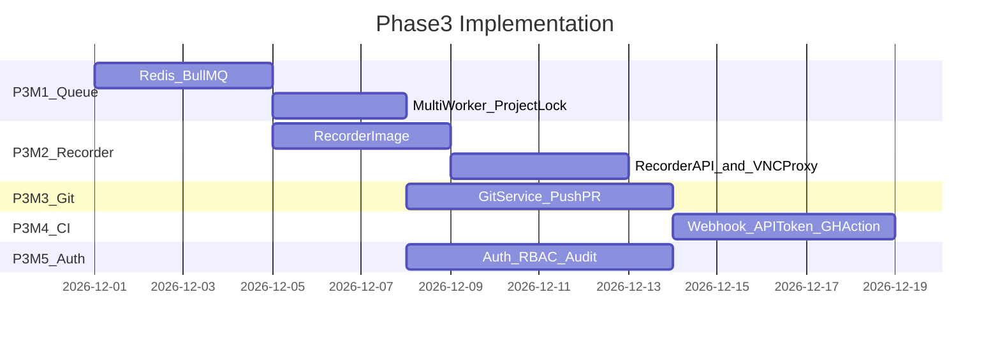
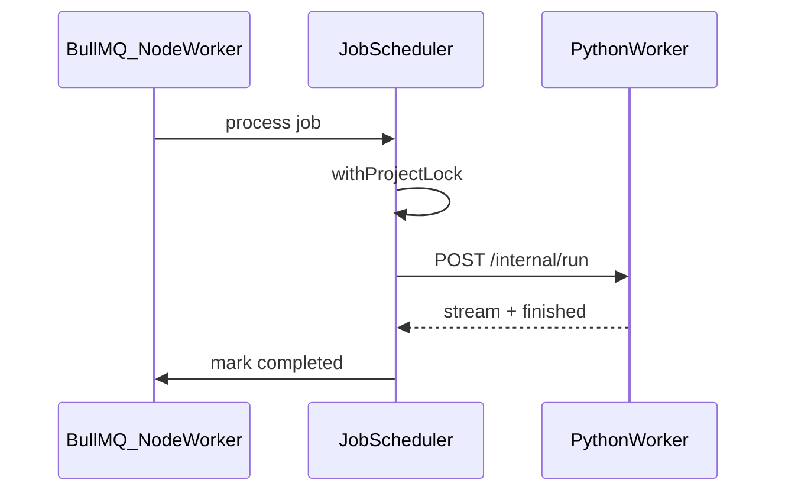

# ai-auto-test-playwright Phase 3 实施 PRD

| 项 | 内容 |
|---|---|
| 版本 | v0.1 |
| 日期 | 2026-09-19 |
| 状态 | Draft |
| 前置文档 | [PRD-Phase3.md](./PRD-Phase3.md)（产品需求）、[PRD-Phase2-Implementation.md](./PRD-Phase2-Implementation.md) |
| 前置条件 | MVP + Phase 2 验收通过 |
| 目标 | 将 Phase 3 拆解为可执行的里程碑、技术方案与验收清单 |

---

## 1. 文档关系

```
PRD.md                           ← MVP 产品
PRD-MVP-Implementation.md        ← MVP 实施
PRD-Phase2.md                    ← Phase 2 产品
PRD-Phase2-Implementation.md     ← Phase 2 实施
PRD-Phase3.md                    ← Phase 3 产品
PRD-Phase3-Implementation.md     ← Phase 3 怎么做（本文档）
```

| 文档 | 读者 | 内容 |
|------|------|------|
| PRD-Phase3.md | PM / 架构 / 开发 | 功能、API、RBAC、Git、队列 |
| **PRD-Phase3-Implementation.md** | 开发 / DevOps | 里程碑、容器、队列、联调 |

---

## 2. Phase 3 交付物清单

| # | 交付物 | 路径 / 模块 | 完成标准 |
|---|--------|-------------|----------|
| D1 | Redis + BullMQ | `docker/docker-compose.yml`、`server/src/queue/` | 任务入队/消费 |
| D2 | Job 调度器 | `server/src/services/job-scheduler.ts` | 替代 MVP mutex |
| D3 | 多 Worker | `docker compose scale worker=3` | 3 路并行 run |
| D4 | 项目级 Redis 锁 | `server/src/services/project-lock.ts` | 同 project 串行 |
| D5 | Recorder 镜像 | `docker/recorder/Dockerfile` | noVNC + codegen |
| D6 | Recorder 编排 | `server/src/services/recorder-service.ts` | start/stop/session |
| D7 | VNC 代理 | `server/src/routes/vnc-proxy.ts` | auth 后 iframe |
| D8 | Git 服务 | `server/src/services/git-service.ts` | clone/push/pr |
| D9 | CI Webhook | `server/src/routes/webhooks.ts` | token 鉴权 |
| D10 | GitHub Action | `.github/actions/run-e2e/action.yml` | 仓库内 action |
| D11 | Auth + RBAC | `server/src/middleware/auth.ts` | JWT + 角色 |
| D12 | 审计日志 | `server/src/services/audit-service.ts` | 关键操作记录 |
| D13 | Phase 3 E2E | `scripts/demo-phase3.sh` | 10 条验收 |

---

## 3. 里程碑与排期

总预估：**4–6 周**（Phase 2 已上线，1–2 人）。



各里程碑可部分并行：`P3-M5` 与 `P3-M2` 可不同人并行。

---

### P3-M1：Redis 队列 + 多 Worker（7 天）

**状态：已完成（v1.0.0-p3m1，2026-09-19）**

**目标：** 移除全局 run mutex；任务经 BullMQ（**Node server 进程消费**）调度；3 Python Worker 并行；同 project 写操作串行。Python Worker **不**直接连 Redis（见 [PRD-Phase3.md ADR-P3-008](./PRD-Phase3.md#13-技术决策记录phase-3-adr)）。

| 任务 ID | 任务 | 产出 | 依赖 |
|---------|------|------|------|
| P3-M1-01 | compose 加 redis 服务 | docker-compose.yml | Phase 2 |
| P3-M1-02 | 迁移 003_phase3.sql | 扩展 MVP jobs 表 + 新表 | — |
| P3-M1-03 | 安装 bullmq + ioredis | server deps | P3-M1-01 |
| P3-M1-04 | job-queue.ts 封装 | enqueue/process | P3-M1-03 |
| P3-M1-05 | job-scheduler.ts | 按 type 分发 handler | P3-M1-04 |
| P3-M1-06 | RunService 改为 enqueue | 返回 jobId | P3-M1-05 |
| P3-M1-07 | Plan/Code/Fix 改 enqueue | 同上 | P3-M1-05 |
| P3-M1-08 | Python Worker 注册 + heartbeat | worker 启动脚本；供 Node 调度器选择 | MVP worker |
| P3-M1-08b | Node BullMQ Worker 进程 | server 内消费队列 → HTTP 调 Python Worker | P3-M1-05 |
| P3-M1-09 | project-lock.ts（Redis SET NX） | 同 project 互斥 | P3-M1-03 |
| P3-M1-10 | Worker 消费前 acquire lock | run/plan/code handler | P3-M1-09 |
| P3-M1-11 | `GET /api/jobs/:id`、`POST cancel` | routes | P3-M1-05 |
| P3-M1-12 | compose `worker` replicas: 3 | docker | P3-M1-08 |
| P3-M1-13 | 移除 isRunning mutex | RunService 清理 | P3-M1-06 |
| P3-M1-14 | Job 进度 WS 事件 | ws-hub 扩展 | P3-M1-05 |

**队列优先级：**

```typescript
const JOB_PRIORITY = {
  run_manual: 10,
  fix_verify: 8,
  run_ci: 5,
  plan: 3,
  code: 3,
  record: 7,
} as const;
```

**Project Lock：**

```typescript
async function withProjectLock<T>(projectId: string, fn: () => Promise<T>): Promise<T> {
  const key = `lock:project:${projectId}`;
  const token = await redis.set(key, workerId, "NX", "EX", 3600);
  if (!token) throw new JobDeferredError("Project busy, requeue");
  try {
    return await fn();
  } finally {
    await redis.del(key);
  }
}
```

**调度流程（Node BullMQ → Python Worker HTTP）：**



**Job 状态机：**

```
pending → active → completed
              ↘ failed
              ↘ cancelled
```

**P3-M1 验收：**

1. 3 个不同 project 的 run 同时 active
2. 同一 project 连续 2 个 run，第二个 pending 直到第一个完成
3. `GET /api/jobs/:id` 状态正确
4. cancel pending job 成功

---

### P3-M2：Web 录制（noVNC + codegen）（8 天）

**状态：已完成（v1.0.0-p3m2，2026-09-19）**

**目标：** Web 内 noVNC 操作浏览器，stop 后自动保存 recorded.py。

| 任务 ID | 任务 | 产出 | 依赖 |
|---------|------|------|------|
| P3-M2-01 | recorder Dockerfile | docker/recorder/ | — |
| P3-M2-02 | entrypoint.sh | Xvfb + fluxbox + x11vnc + websockify + codegen；SIGTERM trap flush | P3-M2-01 |
| P3-M2-03 | 迁移 recorder_sessions 表 | SQL | P3-M1-02 |
| P3-M2-04 | recorder-service.ts | Docker API 或 K8s 可选；MVP 用 dockerode | P3-M2-02 |
| P3-M2-05 | `POST record/start` | 启动容器，挂载 workspace | P3-M2-04 |
| P3-M2-06 | `POST record/stop` | 停止 codegen，拷贝 py | P3-M2-05 |
| P3-M2-07 | vnc-proxy.ts | auth 后反向代理到容器 6080 | P3-M2-05 |
| P3-M2-08 | 会话 idle 超时 30min | cron / setInterval | P3-M2-04 |
| P3-M2-09 | 全局 + 每 project 会话上限 | config | P3-M2-04 |
| P3-M2-10 | Record 页 Web 录制 Tab | iframe vncUrl | P3-M2-07 |
| P3-M2-11 | record job 入队（type=record） | 与队列集成 | P3-M1 |
| P3-M2-12 | MVP upload 录制保留 | 降级 Tab | Phase 2 |

**Recorder 容器启动（dockerode 示意）：**

```typescript
const container = await docker.createContainer({
  Image: "ai-auto-test-playwright-recorder:latest",
  Env: [
    `TARGET_URL=${url}`,
    `MODULE_NAME=${moduleName}`,
    `OUTPUT_PATH=/workspace/tests/recorded/${moduleName}.py`,
  ],
  HostConfig: {
    Binds: [`${workspacePath}:/workspace`],
    PortBindings: { "6080/tcp": [{ HostPort: "0" }] },
    Memory: 2 * 1024 ** 3,
  },
});
await container.start();
```

**VNC 代理安全：**

- URL 带短期 JWT：`/api/projects/:id/record/:sessionId/vnc?token=...`
- token 绑定 userId + sessionId，5 分钟过期
- 不直接暴露容器 IP 给浏览器

**P3-M2 验收：**

1. Web 打开 noVNC → 操作 saucedemo → stop → recorded.py 存在
2. 30min 无操作 session 自动清理
3. 第二路 record/start 超全局上限返回 503
4. upload 录制仍可用

---

### P3-M3：Git 集成（6 天）

**状态：已完成（v1.0.0-p3m3，2026-09-19）**

**目标：** 绑定仓库、push 分支、可选创建 PR。

| 任务 ID | 任务 | 产出 | 依赖 |
|---------|------|------|------|
| P3-M3-01 | 迁移 git_bindings 表 | SQL | P3-M1-02 |
| P3-M3-02 | credential-crypto.ts | AES-256-GCM + MASTER_KEY | — |
| P3-M3-03 | git-service.ts clone | simple-git 或 exec git | P3-M3-02 |
| P3-M3-04 | `PUT /api/projects/:id/git` | 绑定凭据 | P3-M3-03 |
| P3-M3-05 | Git 绑定项目：clone + merge scaffold | 有 Git 则 clone；缺 tests/ 则 copy-if-missing | P3-M3-03 |
| P3-M3-06 | git-service push | 新分支 + commit | P3-M3-03 |
| P3-M3-07 | `POST git/push` | route + diff 预览 | P3-M3-06 |
| P3-M3-08 | GitHub API create PR | Octokit | P3-M3-06 |
| P3-M3-09 | `POST git/pr` | route | P3-M3-08 |
| P3-M3-10 | push 前 .gitignore 校验 | 拒绝 auth.json、venv | P3-M3-06 |
| P3-M3-11 | Settings/Git UI | 绑定表单 + push 按钮 | P3-M3-04 |

**Push 流程：**

```
1. git status / diff -- tests/
2. UI 展示变更文件列表，用户确认
3. git checkout -b e2e/<module>-<ts>
4. git add tests/
5. git commit -m "chore(e2e): ..."
6. git push origin HEAD
7. (optional) gh pr create
```

**P3-M3 验收：**

1. 绑定 GitHub token → clone 成功
2. code 生成后 push → 远程分支可见 tests/
3. auth.json 不在 commit 中
4. create PR 返回 URL

---

### P3-M4：CI 触发（5 天）

**状态：已完成（v1.0.0-p3m4，2026-09-19）**

**目标：** API Token + Webhook + GitHub Action 触发 ci run。

| 任务 ID | 任务 | 产出 | 依赖 |
|---------|------|------|------|
| P3-M4-01 | 迁移 api_tokens 表 | SQL | P3-M1-02 |
| P3-M4-02 | token-service.ts | 生成 hash、scope 校验 | P3-M4-01 |
| P3-M4-03 | `POST /api/tokens` | project scoped | P3-M4-02 |
| P3-M4-04 | auth middleware bearer | ci_bot scope | P3-M4-02 |
| P3-M4-05 | `POST /api/webhooks/ci/run` | enqueue run preset=ci（Jenkins 共用此端点） | P3-M1 |
| P3-M4-06 | runs.trigger_source 字段 | ci \| web \| api | migration |
| P3-M4-07 | callbackUrl POST on finish | RunService | P3-M4-05 |
| P3-M4-08 | GitHub Action yaml | `.github/actions/run-e2e/` | P3-M4-05 |
| P3-M4-09 | Jenkins 文档 + 示例 curl | docs/ci-jenkins.md | P3-M4-05 |
| P3-M4-10 | Settings/Tokens UI | 创建/吊销 token | P3-M4-03 |

**GitHub Action 核心步骤：**

```yaml
runs:
  using: composite
  steps:
    - run: |
        RESP=$(curl -s -X POST "$INPUT_PLATFORM_URL/api/webhooks/ci/run" \
          -H "Authorization: Bearer $INPUT_API_TOKEN" \
          -d '{"projectId":"'"$INPUT_PROJECT_ID"'","preset":"ci"}')
        JOB_ID=$(echo "$RESP" | jq -r .data.jobId)
        RUN_ID=$(echo "$RESP" | jq -r .data.runId)
        # poll GET /api/jobs/$JOB_ID until completed; fallback GET runs/$RUN_ID
        # curl report, exit 1 if failed
```

**P3-M4 验收：**

1. token 仅 run scope 无法 DELETE project
2. webhook 触发 ci run 完成
3. GitHub Action 在失败 run 时 job 红
4. callbackUrl 收到 POST

---

### P3-M5：Auth + RBAC + 审计（6 天）

**状态：已完成（v1.0.0-p3m5，2026-09-19）**

**目标：** 用户登录、项目成员角色、操作审计。

| 任务 ID | 任务 | 产出 | 依赖 |
|---------|------|------|------|
| P3-M5-01 | 迁移 users/orgs/members/audit_logs | SQL | P3-M1-02 |
| P3-M5-02 | auth-service register/login | bcrypt + JWT | P3-M5-01 |
| P3-M5-03 | GitHub OAuth 可选 | passport-github | P3-M5-02 |
| P3-M5-04 | auth middleware | 保护 /api/projects/* | P3-M5-02 |
| P3-M5-05 | rbac middleware | owner/editor/viewer | P3-M5-04 |
| P3-M5-06 | 项目 CRUD 加 org 归属 | ProjectService | P3-M5-01 |
| P3-M5-07 | `POST projects/:id/members` | 邀请 | P3-M5-05 |
| P3-M5-08 | audit-service.ts | 装饰器或显式调用 | P3-M5-01 |
| P3-M5-09 | 审计：record/plan/code/run/fix/push | 各 service 埋点 | P3-M5-08 |
| P3-M5-10 | Login/Register 页面 | dashboard | P3-M5-02 |
| P3-M5-11 | Members 设置页 | dashboard | P3-M5-07 |
| P3-M5-12 | MVP 数据迁移脚本 | 默认 owner 用户 | P3-M5-06 |

**RBAC 矩阵（实施参考）：**

| 操作 | owner | editor | viewer | ci_bot |
|------|-------|--------|--------|--------|
| run | ✓ | ✓ | ✗ | ✓ |
| plan/code | ✓ | ✓ | ✗ | ✗ |
| push git | ✓ | ✓ | ✗ | ✗ |
| view report | ✓ | ✓ | ✓ | ✓ |
| manage members | ✓ | ✗ | ✗ | ✗ |

**P3-M5 验收：**

1. viewer 调用 run 返回 403
2. editor push 成功
3. audit_logs 可查 push 操作人
4. 未登录访问 /api/projects 返回 401

---

## 4. 基础设施变更详图

```mermaid
flowchart TB
    subgraph compose [DockerCompose]
        Dashboard[dashboard:8040]
        Server[server:3001]
        Redis[(redis:6379)]
        PG[(postgres:5432)]
        W1[worker1]
        W2[worker2]
        W3[worker3]
        Rec[recorder_on_demand]
    end

    User[Browser] --> Dashboard
    Dashboard --> Server
    Server --> Redis
    Server --> PG
    Server -->|spawn| Rec
    Redis --> W1
    Redis --> W2
    Redis --> W3
    W1 --> Volume[/data/projects]
    W2 --> Volume
    W3 --> Volume
    Rec --> Volume
    Server -->|VNC proxy| Rec
```

**compose 片段：**

```yaml
services:
  redis:
    image: redis:7-alpine
    ports: ["6379:6379"]
  worker:
    build: { context: .., dockerfile: docker/worker/Dockerfile }
    deploy: { replicas: 3 }
    depends_on: [redis]
    volumes: ["./data/projects:/data/projects"]
  recorder:
    build: { context: .., dockerfile: docker/recorder/Dockerfile }
    profiles: ["recorder-build"]
```

Recorder **不**长期 replicas；由 API 按需 `docker run` 或 compose run。

---

## 5. 联调顺序

```
Phase 2 回归通过
  ↓
1. 起 redis + 3 worker，job 队列跑 ci run
2. 同 project 双 run 排队验证
3. record/start → noVNC → record/stop
4. 绑定 Git → push branch
5. 创建 API token → webhook ci run
6. GitHub Action 端到端
7. 注册 user → 邀请 editor → RBAC 403 验证
8. demo-phase3.sh
```

**分阶段上线建议：**

| 发布包 | 包含 | 可独立上线 |
|--------|------|------------|
| v0.3.0 | P3-M1 队列 | ✓ |
| v0.4.0 | + P3-M2 录制 | ✓ |
| v0.5.0 | + P3-M3 Git | ✓ |
| v0.6.0 | + P3-M4 CI | ✓ |
| v1.0.0 | + P3-M5 RBAC | 全量 |

---

## 6. 测试策略

| 层级 | 范围 | 工具 |
|------|------|------|
| 单元 | project-lock、token hash、RBAC、git path | vitest |
| 集成 | BullMQ enqueue/process（redis testcontainer） | vitest |
| 集成 | git push（Gitea testcontainer） | vitest |
| E2E | demo-phase3.sh | bash |
| 人工 | noVNC 录制 saucedemo | 浏览器 |
| 负载 | 3 worker 3 project 并行 | k6 或脚本 |

---

## 7. 环境变量（Phase 3 新增）

| 变量 | 默认 | 说明 |
|------|------|------|
| `REDIS_URL` | `redis://redis:6379` | BullMQ |
| `WORKER_CONCURRENCY` | `1` | 每 worker 并发 job 数 |
| `PROJECT_LOCK_TTL_SEC` | `3600` | Redis 锁超时 |
| `RECORDER_IDLE_TIMEOUT_MS` | `1800000` | 30 分钟 |
| `RECORDER_MAX_GLOBAL` | `5` | 全局录制会话上限 |
| `GIT_MASTER_KEY` | — | 凭据加密（32 字节 hex） |
| `JWT_SECRET` | — | 用户 session |
| `AUTH_DISABLED` | `false` | 内网 demo 跳过 RBAC；**生产必须 false** |
| `GITHUB_OAUTH_CLIENT_ID` | — | 可选 OAuth |
| `VNC_TOKEN_TTL_SEC` | `300` | VNC 代理 token |

---

## 8. 监控与运维

| 指标 | 来源 | 告警阈值 |
|------|------|----------|
| `queue_depth` | BullMQ | > 20 pending 5min |
| `worker_busy` | heartbeat | 0 alive worker |
| `recorder_sessions_active` | recorder-service | > MAX_GLOBAL |
| `project_lock_wait_ms` | histogram | p95 > 60s |
| `git_push_failures` | counter | > 3/hour |

**日志：** 结构化 JSON；audit_logs 与 application log 分离。

---

## 9. 风险与缓解（实施层）

| 风险 | 缓解 |
|------|------|
| Docker socket 暴露 | recorder 仅 server 可访问 docker.sock；非 root 容器 |
| Git 凭据泄露 | AES + 日志脱敏 + 定期 rotate |
| VNC 未授权访问 | JWT 短期 token + session 绑定 |
| 队列堆积 | 优先级 + worker scale；监控告警 |
| 迁移 MVP 无用户 | 脚本创建 default owner 绑定现有 projects |

---

## 10. PR 清单（建议顺序）

| PR | 范围 | 预估 |
|----|------|------|
| PR-1 | redis + jobs + scheduler + 去 mutex | 5d |
| PR-2 | project lock + 3 worker scale | 2d |
| PR-3 | recorder image + start/stop API | 4d |
| PR-4 | vnc proxy + Record UI Tab | 4d |
| PR-5 | git binding + push + UI | 6d |
| PR-6 | api tokens + webhook + GH action | 5d |
| PR-7 | auth + rbac + audit + login UI | 6d |
| PR-8 | demo-phase3.sh + docs + monitoring | 2d |

---

## 11. Phase 3 完成定义（Definition of Done）

- [x] [PRD-Phase3.md 第 8 章](./PRD-Phase3.md#8-验收标准) 10 条验收通过
- [x] `scripts/demo-phase3.sh` 绿
- [x] Phase 2 回归无破坏
- [x] 安全 review：凭据、VNC、RBAC
- [x] README 部署文档含 redis、worker scale、MASTER_KEY
- [x] 无 P0/P1 open bug

---

## 12. 与 Phase 4 边界（实施后）

Phase 3 实施 PRD **不包含**：

- SSO/SAML（Phase 4）
- Browserbase 云浏览器（Phase 3.1 可选 spike）
- 多区域 Worker
- SaaS 计费

完成 Phase 3 后，若需 enterprise，再写 `PRD-Phase4.md`。

---

## 附录 A：003_phase3.sql 表清单

```sql
-- 新建
CREATE TABLE recorder_sessions (...);
-- 扩展 MVP jobs 表
ALTER TABLE jobs ADD COLUMN payload JSONB, ADD COLUMN priority INT DEFAULT 0,
  ADD COLUMN worker_id TEXT;
CREATE TABLE git_bindings (...);
CREATE TABLE api_tokens (...);
CREATE TABLE users (...);
CREATE TABLE organizations (...);
CREATE TABLE org_members (...);
CREATE TABLE project_members (...);
CREATE TABLE audit_logs (...);

-- 变更
ALTER TABLE runs ADD COLUMN trigger_source TEXT DEFAULT 'web';
ALTER TABLE projects ADD COLUMN org_id UUID REFERENCES organizations(id);
```

---

## 附录 B：demo-phase3.sh 大纲

```bash
#!/usr/bin/env bash
# 1. login → JWT
# 2. record/start → open vnc (headless curl check session active)
# 3. record/stop → recorded.py exists
# 4. enqueue 3 runs different projects → all complete
# 5. same project 2 runs → second waits
# 6. git push branch
# 7. webhook ci run with api token
# 8. viewer 403 on run
# 9. audit log entry exists
```

---

## 附录 C：Recorder entrypoint.sh 要点

```bash
#!/bin/bash
set -e
cleanup() {
  # SIGTERM 时确保 codegen 进程退出并 flush recorded.py
  kill -TERM "$CODEGEN_PID" 2>/dev/null || true
  wait "$CODEGEN_PID" 2>/dev/null || true
}
trap cleanup SIGTERM SIGINT

Xvfb :99 -screen 0 1280x720x24 &
export DISPLAY=:99
fluxbox &
x11vnc -display :99 -nopw -listen localhost -xkb &
websockify --web /usr/share/novnc 6080 localhost:5900 &
npx playwright codegen "$TARGET_URL" \
  --target python-pytest \
  -o "$OUTPUT_PATH" &
CODEGEN_PID=$!
wait "$CODEGEN_PID"
# 退出码 0 后 server 侧 stop 回收容器
```
