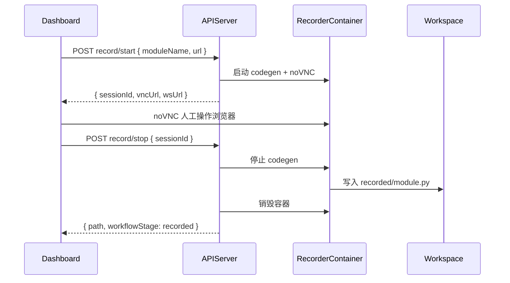
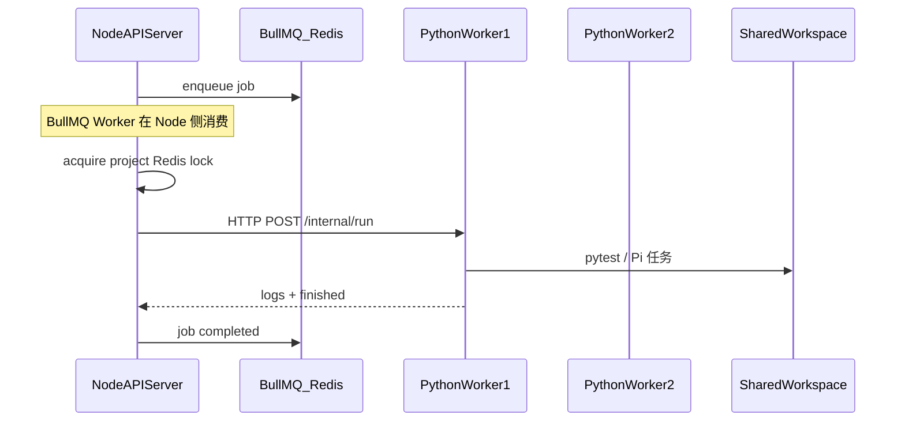

# ai-auto-test-playwright Phase 3 产品需求文档

| 项 | 内容 |
|---|---|
| 版本 | v0.1 |
| 日期 | 2026-09-19 |
| 状态 | Draft |
| 前置文档 | [PRD.md](./PRD.md)、[PRD-Phase2.md](./PRD-Phase2.md) |
| 前置条件 | MVP + Phase 2 验收通过 |

---

## 1. 背景与目标

### 1.1 Phase 2 后的遗留痛点

Phase 2 解决了计划编辑、fix 闭环、CI 模式与运行对比，但平台仍偏「单机工具」：

| 痛点 | Phase 2 现状 | Phase 3 目标 |
|------|--------------|--------------|
| 录制依赖本地 | 用户需本机 codegen，再上传 `recorded.py` | Web 内完成浏览器录制 |
| 执行并发低 | 单 Worker mutex，多项目/多人排队 | Redis 队列 + 多 Worker 水平扩展 |
| 代码孤岛 | 测试工程只在平台 workspace，与业务仓库脱节 | Git 仓库绑定、分支推送、可选 PR |
| CI 未打通 | 只能在 Web 手动点 run | GitHub Actions / Jenkins 触发 |
| 无团队协作 | 无账号、无项目权限 | 基础 RBAC（组织 / 项目 / 角色） |
| 远程 Agent 不可用 | 服务器 Agent 无法让人工操作浏览器 | noVNC 或云浏览器 iframe 解决 |

### 1.2 Phase 3 目标

将平台从 **个人效率工具** 升级为 **团队可部署的 E2E 测试平台**：

1. **录制 Web 化** — 浏览器内人工操作，无需本地 codegen
2. **执行可扩展** — 任务队列、多 Worker、优先级调度
3. **与研发流程集成** — Git 仓库、分支、CI 触发
4. **基础多用户** — 登录、项目权限、操作审计

### 1.3 范围

| 包含 | 不包含（后续版本） |
|------|-------------------|
| Web 录制（noVNC + codegen 容器） | 多区域 Worker 调度 |
| Redis 任务队列 + 多 Worker | 计费 / 配额商业化 |
| Git 仓库绑定、clone、push branch | GitLab CI 以外全部 CI 平台 |
| GitHub Actions 官方 Action | 自研测试用例管理（非 codegen 来源） |
| Jenkins webhook 触发 | SSO / SAML（仅基础 JWT 登录） |
| 组织 / 项目 / 角色 RBAC | 细粒度字段级权限 |
| 操作审计日志 | 合规认证（SOC2 等） |

### 1.4 成功指标

| 指标 | 目标 |
|------|------|
| Web 录制成功率 | >= 90%（标准 Chromium 站点） |
| 录制 → 上传 workspace 自动化 | 用户零手动拷贝文件 |
| 队列任务 P95 等待时间 | < 30s（3 Worker 负载下） |
| Git push 成功率 | >= 95%（凭据有效时） |
| GitHub Actions 触发 run 端到端 | < 5 分钟（ci preset） |
| 并发项目 run | >= 3 路同时执行 |

---

## 2. 功能需求

### 2.1 Web 内嵌录制（noVNC + Codegen）

**用户故事：** 作为测试工程师，我在 Web 里打开被测 URL，在远程浏览器中操作，平台自动保存录制代码，无需本地安装 Playwright。

#### 方案选型

| 方案 | 描述 | Phase 3 决策 |
|------|------|--------------|
| A. noVNC + codegen | 容器内 Xvfb + Chromium + `playwright codegen`，Web iframe 嵌入 noVNC | **MVP 采用** |
| B. playwright-cli recording | `playwright-cli recording-start/stop`，Agent 驱动为主 | 备选 / Phase 3.1 |
| C. 云浏览器（Browserbase 等） | iframe + 事件回传 | 可选插件，非默认 |

#### 功能点

| ID | 功能 | 说明 |
|----|------|------|
| P3-REC-01 | 启动录制会话 | 为项目分配独立 recorder 容器或 pod |
| P3-REC-02 | noVNC 嵌入 | Dashboard `/projects/:id/record/live` iframe 操作浏览器 |
| P3-REC-03 | Inspector 同步 | 可选第二面板展示 Playwright Inspector 输出（WebSocket 转发） |
| P3-REC-04 | 停止并保存 | 终止 codegen，写入 `tests/recorded/<module>.py` |
| P3-REC-05 | 会话超时 | 空闲 30 分钟自动释放容器 |
| P3-REC-06 | 并发限制 | 每项目同时 1 个录制会话；全局最多 N 路（可配置） |
| P3-REC-07 | 录制指引 | UI 覆盖场景 checklist（同 MVP codegen skill 提示） |

#### 架构



#### Recorder 容器规格

- 基础镜像：在 Worker 镜像上增加 noVNC + fluxbox（或 websockify）
- 启动命令：`xvfb-run npx playwright codegen <url> --target python-pytest -o /workspace/tests/recorded/<module>.py`
- 资源：CPU 2 核、内存 2GB、单会话
- 网络：需访问被测 URL（出站 HTTPS）

#### 限制说明（需在 UI 明确告知）

- 不支持本地文件选择对话框的上传场景（需 Phase 3.1 增强）
- 跨域 / 强 SSO 站点可能需要额外 cookie 注入配置
- 录制质量仍依赖人工操作完整性

---

### 2.2 Redis 任务队列 + 多 Worker

**用户故事：** 多人同时使用平台时，run / plan / code / fix 任务排队有序执行，可通过增加 Worker 提升吞吐。

#### 功能点

| ID | 功能 | 说明 |
|----|------|------|
| P3-QUEUE-01 | Redis 队列 | BullMQ（**Node server 进程消费**），复用 MVP `jobs` 表 |
| P3-QUEUE-02 | Job 类型 | `run` \| `plan` \| `code` \| `fix` \| `record` |
| P3-QUEUE-03 | 多 Python Worker 池 | BullMQ Worker（Node）调度 → HTTP 调用空闲 Python Worker |
| P3-QUEUE-04 | 优先级 | run（用户手动）> fix verify > plan/code > ci 触发 |
| P3-QUEUE-05 | 任务状态 | pending / active / completed / failed / cancelled |
| P3-QUEUE-06 | 取消任务 | 用户取消 queued；running 发 SIGTERM |
| P3-QUEUE-07 | 重试策略 | run 失败不自动重试；plan/code Pi 失败最多 1 次重试 |
| P3-QUEUE-08 | 移除 MVP mutex | 由队列 + Worker 池替代全局单锁 |

#### Job 模型

```typescript
interface Job {
  id: string;
  type: "run" | "plan" | "code" | "fix" | "record";
  projectId: string;
  payload: Record<string, unknown>;
  priority: number;
  status: "pending" | "active" | "completed" | "failed" | "cancelled";
  workerId?: string;
  createdAt: string;
  startedAt?: string;
  finishedAt?: string;
}
```

#### 架构

BullMQ **仅在 Node API Server 进程内消费**；Python Worker **不**直接连接 Redis，仍通过 MVP 的 HTTP `POST /internal/run` 执行 pytest/Pi 任务（见 ADR-P3-008）。



**存储注意：** 多 Python Worker 挂载同一项目 workspace 时需 **项目级 Redis 锁**（`lock:project:{id}`）。

推荐：**run/plan/code 同 project 串行，不同 project 并行**。

---

### 2.3 Git 仓库集成

**用户故事：** 测试代码生成后推送到业务仓库的指定分支，便于 Code Review 与版本管理。

#### 功能点

| ID | 功能 | 说明 |
|----|------|------|
| P3-GIT-01 | 绑定远程仓库 | HTTPS 或 SSH URL + 凭据（token/deploy key） |
| P3-GIT-02 | 克隆 / 拉取 | 项目 workspace 初始化自 Git clone |
| P3-GIT-03 | 分支策略 | 默认 `e2e/<module>-<timestamp>` 新分支 |
| P3-GIT-04 | 提交推送 | code/generate 或用户手动触发 push |
| P3-GIT-05 | 提交信息模板 | `chore(e2e): add saucedemo tests via ai-auto-test-playwright` |
| P3-GIT-06 | PR 创建 | GitHub/GitLab API 创建 PR/MR（可选，需 token scope） |
| P3-GIT-07 | .gitignore 合并 | 确保 auth.json、report、venv 不提交 |
| P3-GIT-08 | 同步方向 | 平台 → Git 为主；Git pull 覆盖需确认 |

#### 工作流

```
绑定 Git → clone 到 workspace → 正常 workflow → push branch →（可选）开 PR
```

#### 与 MVP scaffold 初始化策略

| 场景 | 初始化方式 |
|------|------------|
| **无 Git 绑定** | 沿用 MVP `POST init-template`（copy-if-missing scaffold） |
| **有 Git 绑定** | `git clone` 到 workspace → 若缺少 `tests/` 结构则 **merge scaffold**（copy-if-missing）→ 后续 workflow 不变 |
| **Git pull** | 用户确认后覆盖本地变更；平台生成代码以 workspace 为准 |

#### 安全

- 凭据存加密字段（AES）或 Vault；日志脱敏
- SSH key 仅平台服务可读
- push 前 diff 预览，用户确认变更文件列表

---

### 2.4 CI 触发集成

**用户故事：** 业务仓库 CI 在部署后自动触发平台 pytest ci 模式，结果回写 CI status。

#### GitHub Actions

提供官方 composite action：`ai-auto-test-playwright/run-e2e@v1`

```yaml
- uses: ai-auto-test-playwright/run-e2e@v1
  with:
    platform-url: https://e2e.example.com
    project-id: proj_xxx
    api-token: ${{ secrets.E2E_PLATFORM_TOKEN }}
    preset: ci
```

Action 行为：`POST /api/projects/:id/run` → 轮询完成 → 下载 report  artifact → 失败则 exit 1。

#### Jenkins

- Webhook：`POST /api/webhooks/ci/run`（与 GitHub Actions / 自定义 CI 共用端点）
- Header：`Authorization: Bearer <api_token>`（或 legacy `X-Platform-Token` alias）
- Body：`{ projectId, preset: "ci", callbackUrl? }`
- 可选 callback 通知 Jenkins pipeline 阶段

#### 平台侧

| ID | 功能 | 说明 |
|----|------|------|
| P3-CI-01 | API Token | 每项目或每组织生成 long-lived token |
| P3-CI-02 | Webhook 端点 | `POST /api/webhooks/ci/run`（Jenkins / GitHub Actions / 自定义） |
| P3-CI-03 | Run 来源标记 | `runs.trigger_source = ci` \| `web` \| `api` |
| P3-CI-04 | Status 回调 | run 结束 POST 到 callbackUrl（可选） |

---

### 2.5 基础 RBAC 与审计

**用户故事：** 团队成员登录平台，按角色访问项目；关键操作可追溯。

#### 角色定义

| 角色 | 权限 |
|------|------|
| `owner` | 项目全部操作 + 删除 + 凭据管理 |
| `editor` | 录制、计划、生成、run、fix、push |
| `viewer` | 只读报告、计划、代码 |
| `ci_bot` | 仅 `POST run`（token 绑定） |

#### 功能点

| ID | 功能 | 说明 |
|----|------|------|
| P3-AUTH-01 | 用户注册 / 登录 | Email + 密码或 GitHub OAuth |
| P3-AUTH-02 | JWT 会话 | API Bearer token |
| P3-AUTH-03 | 组织 | 多项目归属 org |
| P3-AUTH-04 | 项目成员 | owner 邀请 editor/viewer |
| P3-AUTH-05 | 审计日志 | record/plan/code/run/fix/push 写 audit_logs |
| P3-AUTH-06 | API Token | 供 CI 使用，scoped to project |

---

## 3. API 规格（Phase 3 新增）

### 3.1 录制会话

| Method | Path | 说明 |
|--------|------|------|
| POST | `/api/projects/:id/record/start` | 启动 Web 录制 |
| POST | `/api/projects/:id/record/stop` | 停止并保存 |
| GET | `/api/projects/:id/record/session` | 当前会话状态 |
| DELETE | `/api/projects/:id/record/session` | 强制释放 |

**POST record/start Request:**

```json
{
  "moduleName": "saucedemo",
  "url": "https://www.saucedemo.com"
}
```

**Response 201:**

```json
{
  "ok": true,
  "data": {
    "sessionId": "rec_01HXYZ",
    "vncUrl": "/api/projects/:id/record/rec_01HXYZ/vnc",
    "inspectorWsUrl": "wss://.../inspector",
    "expiresAt": "2026-09-20T11:00:00.000Z"
  }
}
```

MVP 的 `POST record/upload` **保留**，作为降级路径。

### 3.2 队列与 Worker

| Method | Path | 说明 |
|--------|------|------|
| GET | `/api/jobs/:jobId` | 任务状态 |
| POST | `/api/jobs/:jobId/cancel` | 取消 |
| GET | `/api/admin/workers` | Worker 列表（admin） |
| GET | `/api/admin/queue/stats` | 队列深度、吞吐 |

**API 兼容（Phase 3）：** `POST run` / `plan/generate` 等响应**同时返回** `jobId` 与 `runId`（若已创建）：

```json
{
  "ok": true,
  "data": {
    "jobId": "job_01HXYZ",
    "runId": "run_01HABC",
    "status": "pending"
  }
}
```

- `runId` 在 job 创建时预分配并写入 `jobs.result`
- 客户端可继续用 `runId` 查 report（MVP 兼容）；队列状态用 `GET /api/jobs/:jobId`
- `GET /api/jobs/:jobId` 响应始终含 `result.runId`（type=run 时）

### 3.3 Git

| Method | Path | 说明 |
|--------|------|------|
| PUT | `/api/projects/:id/git` | 绑定仓库凭据 |
| GET | `/api/projects/:id/git` | 绑定状态（无 secrets） |
| POST | `/api/projects/:id/git/sync` | pull 最新 |
| POST | `/api/projects/:id/git/push` | push 当前 workspace |
| POST | `/api/projects/:id/git/pr` | 创建 PR |

**POST git/push Request:**

```json
{
  "branch": "e2e/saucedemo-20260920",
  "message": "chore(e2e): add saucedemo pytest suite",
  "paths": ["tests/"]
}
```

### 3.4 CI Webhook

| Method | Path | 说明 |
|--------|------|------|
| POST | `/api/webhooks/ci/run` | 外部 CI 触发 run |
| POST | `/api/tokens` | 创建 API token |
| DELETE | `/api/tokens/:id` | 吊销 token |

**POST webhooks/ci/run Request:**

```json
{
  "projectId": "proj_xxx",
  "preset": "ci",
  "callbackUrl": "https://jenkins.example.com/callback"
}
```

Header: `Authorization: Bearer <api_token>`

### 3.5 认证与用户

| Method | Path | 说明 |
|--------|------|------|
| POST | `/api/auth/register` | 注册 |
| POST | `/api/auth/login` | 登录 → JWT |
| GET | `/api/me` | 当前用户 |
| GET | `/api/orgs/:orgId/projects` | 组织项目列表 |
| POST | `/api/projects/:id/members` | 邀请成员 |

---

## 4. 数据模型变更

### 4.1 新增表

**users**

| 字段 | 类型 |
|------|------|
| id | UUID PK |
| email | TEXT UNIQUE |
| password_hash | TEXT |
| github_id | TEXT NULL |
| created_at | TIMESTAMPTZ |

**organizations / org_members / project_members**

标准多对多关系。

**jobs**（扩展 MVP 已有表，非新建）

| 字段 | 类型 | 说明 |
|------|------|------|
| id | UUID PK | MVP 已有 |
| type | TEXT | MVP 已有；Phase 3 新增 `record` |
| project_id | UUID FK | MVP 已有 |
| payload | JSONB | **Phase 3 新增** |
| priority | INT | **Phase 3 新增** |
| status | TEXT | MVP 已有 |
| worker_id | TEXT NULL | **Phase 3 新增**（Python Worker 标识） |
| result | JSONB NULL | MVP 已有 |
| created_at / started_at / finished_at | TIMESTAMPTZ | MVP 已有 |

**recorder_sessions**

| 字段 | 类型 |
|------|------|
| id | UUID PK |
| project_id | UUID FK |
| module_name | TEXT |
| container_id | TEXT |
| vnc_port | INT |
| status | TEXT |
| recorded_path | TEXT NULL |
| started_at / ended_at | TIMESTAMPTZ |

**git_bindings**

| 字段 | 类型 |
|------|------|
| project_id | UUID PK FK |
| remote_url | TEXT |
| default_branch | TEXT |
| credential_encrypted | BYTEA |
| auth_type | TEXT |

**api_tokens**

| 字段 | 类型 |
|------|------|
| id | UUID PK |
| project_id | UUID FK |
| token_hash | TEXT |
| scopes | JSONB |
| expires_at | TIMESTAMPTZ NULL |

**audit_logs**

| 字段 | 类型 |
|------|------|
| id | UUID PK |
| user_id | UUID NULL |
| project_id | UUID |
| action | TEXT |
| metadata | JSONB |
| created_at | TIMESTAMPTZ |

### 4.2 迁移

`server/migrations/003_phase3.sql`

---

## 5. 基础设施变更

### 5.1 docker-compose 扩展

```yaml
services:
  redis:
    image: redis:7-alpine
  server:
    depends_on: [postgres, redis]
  worker:
    deploy:
      replicas: 3
  recorder:
    build: docker/recorder
    # 按需 scale，非长期 replicas
  dashboard:
    unchanged
```

### 5.2 新增组件

| 组件 | 职责 |
|------|------|
| `recorder` | noVNC + codegen 短生命周期容器 |
| `redis` | BullMQ 队列 |
| `worker` × N | pytest / Pi job 执行 |
| `server` | API + 调度器 + WebSocket |

### 5.3 网络与安全

- **部署前提：** Linux 主机 + Docker；API Server 需挂载 `docker.sock`（recorder 按需 spawn，见 ADR-P3-008）
- Recorder 容器仅内网暴露 VNC，经 API 网关 auth 代理；stop 时 SIGTERM 优雅退出确保 codegen flush
- Worker 出站访问被测 URL
- Git 凭据 KMS 或 env master key 加密
- **生产环境须 v1.0.0（含 RBAC）**；内网 demo 可用 `AUTH_DISABLED=true`（默认 false，不可用于公网）

---

## 6. UI 变更

| 页面 | Phase 3 变更 |
|------|--------------|
| `/projects/:id/record` | 新增「Web 录制」Tab：iframe noVNC + 开始/停止 |
| `/projects/:id/settings/git` | 绑定仓库、凭据、push 按钮 |
| `/projects/:id/settings/members` | 成员与角色 |
| `/projects/:id/run` | 显示队列位置、预计等待 |
| **新增** `/jobs/:jobId` | 通用 job 进度页 |
| **新增** `/settings/tokens` | CI API token 管理 |
| 全局 | 登录 / 注册；org 切换 |

---

## 7. 实施里程碑

预估 **4–6 周**（Phase 2 已上线前提下）。任务 ID、容器规格与联调顺序详见 **[PRD-Phase3-Implementation.md](./PRD-Phase3-Implementation.md)**。

| 里程碑 | 内容 | 预估 |
|--------|------|------|
| **P3-M1** | Redis + BullMQ（Node 调度）+ 多 Python Worker + 移除 mutex | 7d |
| **P3-M2** | Recorder 容器 + noVNC + record/start/stop API + UI | 8d |
| **P3-M3** | Git 绑定 + push + PR | 6d |
| **P3-M4** | CI webhook + GitHub Action + API token | 5d |
| **P3-M5** | 用户 / RBAC / 审计日志 | 6d |

### 建议 PR 顺序

1. `feat(phase3): redis job queue and multi-worker`
2. `feat(phase3): web recorder with novnc`
3. `feat(phase3): git integration`
4. `feat(phase3): ci webhook and github action`
5. `feat(phase3): auth rbac and audit`

---

## 8. 验收标准

1. Web 录制：noVNC 操作 saucedemo → stop → `recorded/saucedemo.py` 存在
2. 3 Worker 同时跑 3 个不同 project 的 ci run，互不干扰
3. 同 project 两个 run 请求排队，不会 workspace 冲突
4. Git push 到新分支，远程可见 tests/ 目录
5. GitHub Action 触发 run，失败时 CI job 红
6. viewer 无法 push / run；editor 可以
7. audit_logs 可查最近 push 与 run 操作人
8. API token 可 scoped 仅 run，无法 delete project
9. 录制会话 30 分钟 idle 自动释放容器
10. upload 录制路径仍可用（降级）

---

## 9. 非功能需求

| 项 | 要求 |
|----|------|
| 可用性 | 单 Worker 故障，队列任务重新分配 |
| 扩展 | Worker horizontal scaling，目标 10 并发 run |
| 安全 | OWASP 基础；凭据加密；VNC 需 auth |
| 备份 | Git 为主备份；workspace 日快照可选 |
| 监控 | Prometheus：queue depth、worker busy、recorder sessions |

---

## 10. 风险与缓解

| 风险 | 缓解 |
|------|------|
| noVNC 延迟高 | 提示最佳实践；保留本地上传 |
| 多 Worker workspace 竞态 | 项目级 Redis 锁 |
| Git 凭据泄露 | 加密存储 + 最小 scope token |
| Recorder 资源耗尽 | 全局 session 上限 + 排队 |
| SSO 站点难录制 | 文档 + cookie 注入高级配置（Phase 3.1） |

---

## 11. Phase 3.1 / Phase 4 展望

未纳入 Phase 3 核心范围，后续可选：

| 项 | 说明 |
|----|------|
| playwright-cli Web 录制 | 替代 codegen，更轻量 |
| Browserbase / 云浏览器 | 免运维 recorder |
| GitLab CI / CircleCI 插件 | 更多 CI |
| SSO / SAML | 企业登录 |
| 多区域 Worker | 就近执行 |
| 用量配额与计费 | SaaS 化 |

---

## 12. 文档关系

```
PRD.md                         ← MVP 产品
PRD-MVP-Implementation.md      ← MVP 实施
PRD-Phase2.md                  ← Phase 2 产品
PRD-Phase2-Implementation.md   ← Phase 2 实施
PRD-Phase3.md                  ← 本文档（产品）
PRD-Phase3-Implementation.md   ← Phase 3 实施
```

---

## 13. 技术决策记录（Phase 3 ADR）

| ID | 决策 | 理由 |
|----|------|------|
| ADR-P3-001 | Web 录制用 noVNC + codegen | 与 MVP skill 输出格式一致 |
| ADR-P3-002 | BullMQ + Redis | 与 Node server 栈一致 |
| ADR-P3-003 | 同 project 串行 | 避免 workspace 写冲突 |
| ADR-P3-004 | Git push 新分支 | 不直接推 main，安全 |
| ADR-P3-005 | GitHub OAuth + 本地账号并存 | 降低接入门槛 |
| ADR-P3-006 | CI 用 API token 非用户 JWT | 长期运行、易吊销 |
| ADR-P3-007 | 保留 upload 录制 | noVNC 降级路径 |
| ADR-P3-008 | BullMQ 在 Node 调度，Python Worker 走 HTTP | BullMQ 为 Node 库；Python Worker 不连 Redis；调度层负责 project lock + Worker 选择 |

---

## 附录 A：三阶段能力矩阵

| 能力 | MVP | Phase 2 | Phase 3 |
|------|-----|---------|---------|
| 上传录制 | ✓ | ✓ | ✓ |
| Web 录制 | — | — | ✓ |
| AI 计划/代码 | ✓ | ✓ + 编辑 | ✓ |
| fix | 只读 | apply 闭环 | ✓ |
| run headed/ci | headed | + preset | ✓ + 队列 |
| 多 Worker | — | — | ✓ |
| Git | — | — | ✓ |
| CI 触发 | — | — | ✓ |
| RBAC | — | — | ✓ |

> **说明：** Phase 3 的 **Web 录制 noVNC** 仅用于人工 codegen（`/record`），**不是** Run 页执行时的浏览器预览。Run 期 noVNC 为 **Phase 4** 范围，见 [PRD-Phase4.md](./PRD-Phase4.md) 与 [docs/RUN-VNC.md](./docs/RUN-VNC.md)。

---

## 附录 B：Recorder 容器 Dockerfile 要点

```dockerfile
FROM mcr.microsoft.com/playwright:v1.63.0-noble
RUN apt-get update && apt-get install -y x11vnc xvfb fluxbox websockify
COPY recorder/entrypoint.sh /entrypoint.sh
EXPOSE 6080
ENTRYPOINT ["/entrypoint.sh"]
```

`entrypoint.sh` 启动 Xvfb → fluxbox → x11vnc → websockify → `playwright codegen`。
