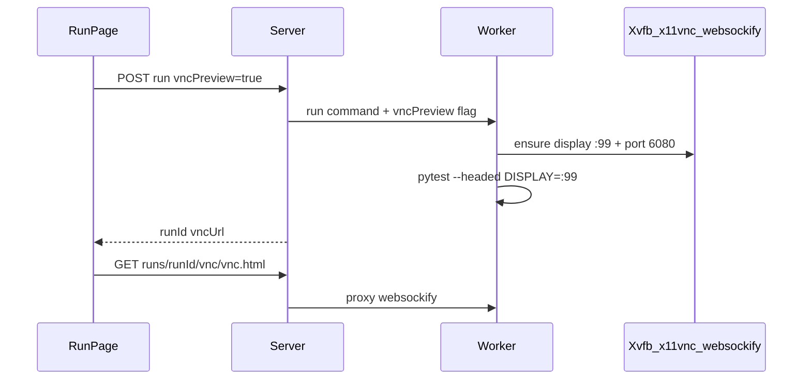

# ai-auto-test-playwright Phase 4 实施 PRD（Run 期 noVNC）

| 项 | 内容 |
|---|---|
| 版本 | v0.1 |
| 日期 | 2026-09-22 |
| 状态 | Implemented（Phase 4.0） |
| 产品 PRD | [PRD-Phase4.md](./PRD-Phase4.md) |
| 前置条件 | Phase 3 已交付（含 recorder + vnc-proxy） |

---

## 1. 文档关系

```
PRD-Phase4.md                    ← 功能、API、验收（产品）
PRD-Phase4-Implementation.md     ← 本文档：里程碑、改动文件、联调
docs/RUN-VNC.md                  ← 速查
```

| 文档 | 读者 | 内容 |
|------|------|------|
| PRD-Phase4.md | PM / 架构 | 范围、API、UI、ADR |
| **PRD-Phase4-Implementation.md** | 开发 / DevOps | Worker/VNC、代理、Dashboard、验收脚本 |

---

## 2. Phase 4 交付物清单

| # | 交付物 | 路径 / 模块 | 完成标准 |
|---|--------|-------------|----------|
| D1 | Worker 虚拟桌面栈 | `docker/worker/Dockerfile`、`worker/entrypoint-vnc.sh`（或合并 entrypoint） | headed + preview 时 DISPLAY=:99 稳定 |
| D2 | Worker run 分支 | `worker/server.py` | `vncPreview` 时不使用一次性 `xvfb-run` 包装 |
| D3 | Compose 网络 | `docker/docker-compose.yml`、`.env.example` | server 可访问 `worker:6080`；可选宿主机映射 `WORKER_VNC_PORT` |
| D4 | Run VNC 代理 | `server/src/routes/run-vnc-proxy.ts` 或扩展 `vnc-proxy.ts` | HTTP + WS 代理；run 生命周期校验 |
| D5 | Run 编排 | `run-service.ts`、`run-presets.ts`、`pytest-runner.ts` | debug 默认 `vncPreview`；响应 `vncUrl` |
| D6 | Run UI | `dashboard/src/pages/RunPage.tsx`、可选 `utils/vncEmbed.ts` | iframe + 文案 |
| D7 | 验收脚本 | `scripts/demo-run-vnc.sh` | curl vnc.html + 短跑 headed |
| D8 | 文档 | `docs/ACCEPTANCE.md` | Phase 4 Run VNC 条目 |

---

## 3. 技术方案摘要

### 3.1 当前 Run 路径（对照）

```text
RunPage → POST run → RunService → Worker POST /internal/run
Worker: xvfb-run -a sh -c "cd tests && pytest ... --headed ..."
→ Chromium 在临时虚拟屏，无 websockify，Dashboard 不可见
```

### 3.2 目标 Run 路径（Phase 4）



### 3.3 方案选择（Phase 4.0）

| 方案 | 描述 | 决策 |
|------|------|------|
| A. Worker 内固定 VNC | 单 Worker 常驻 Xvfb + x11vnc + websockify；preview run 共用 `:99` | **Phase 4.0 采用** |
| B. Ephemeral run 容器 | 每 run `docker run` 动态端口，复刻 recorder | Phase 4.1 备选（多 Worker 并行预览） |

**约束：** 同 project 已串行 run；Phase 4.0 全局仅一路 headed preview 可接受。

---

## 4. 里程碑

### P4-M1 — Worker 长生命周期虚拟桌面

**目标：** headed + `vncPreview` 时 pytest 使用持久 `DISPLAY=:99`，且 websockify 可连。

| 任务 | 说明 |
|------|------|
| P4-M1-01 | Dockerfile 安装 `x11vnc`、`websockify`、`novnc`（或仅 RFB，由 server 提供静态 noVNC 页） |
| P4-M1-02 | 启动脚本：Xvfb `:99` 1280x720x24 → x11vnc `:5900` → websockify `6080` |
| P4-M1-03 | `worker/server.py`：`vncPreview=true` 时 **不** 包 `xvfb-run`；设置 `env DISPLAY=:99` |
| P4-M1-04 | headless 路径保持现状（无 VNC 栈或可不启动 websockify） |
| P4-M1-05 | Worker `/health` 可选增加 `vncReady` 字段 |

**关键文件：**

- [`docker/worker/Dockerfile`](docker/worker/Dockerfile)
- [`worker/server.py`](worker/server.py)

**Worker 请求体扩展（internal API）：**

```json
{
  "runId": "...",
  "command": "cd tests && pytest ...",
  "vncPreview": true
}
```

---

### P4-M2 — Compose 与网络

**目标：** Server 容器通过 Docker 内网访问 Worker websockify。

| 任务 | 说明 |
|------|------|
| P4-M2-01 | Worker `EXPOSE 6080`（websockify） |
| P4-M2-02 | Server env：`WORKER_VNC_HOST=worker`、`WORKER_VNC_PORT=6080`（与 `WORKER_URL` 并列） |
| P4-M2-03 | 可选：`.env` `WORKER_VNC_HOST_PORT=6081` 映射到宿主机，便于人工调试 noVNC |
| P4-M2-04 | **不**默认使用 `RECORDER_VNC_HOST=host.docker.internal` 模式（recorder 专用） |

**关键文件：**

- [`docker/docker-compose.yml`](docker/docker-compose.yml)
- [`docker/.env.example`](docker/.env.example)

---

### P4-M3 — Server 代理与 Run 编排

**目标：** 鉴权后的 Run VNC 代理；run 记录携带 `vncUrl`。

| 任务 | 说明 |
|------|------|
| P4-M3-01 | `parseRunVncProxyPath`：`/api/projects/:id/runs/:runId/vnc(/.*)?` |
| P4-M3-02 | 解析 run：仅 `status=running` 且 options 含 `vncPreview` 时转发 |
| P4-M3-03 | JWT：`createVncToken(runId, userId)` 或复用 session 模式，verify 对称 record |
| P4-M3-04 | [`run-presets.ts`](server/src/services/run-presets.ts)：`debug` → `vncPreview: true`；`ci` → false |
| P4-M3-05 | [`run-service.ts`](server/src/services/run-service.ts)：persist options；`wsHub` `run_started` 带 `vncUrl` |
| P4-M3-06 | [`server/src/index.ts`](server/src/index.ts)：WS upgrade 注册 run vnc 路径 |

**参考实现：** [`server/src/routes/vnc-proxy.ts`](server/src/routes/vnc-proxy.ts)、[`server/src/routes/record-live.ts`](server/src/routes/record-live.ts)

**Run options DB JSON 扩展：**

```json
{
  "headed": true,
  "slowmo": 600,
  "vncPreview": true
}
```

---

### P4-M4 — Dashboard

**目标：** Run 页运行中展示预览。

| 任务 | 说明 |
|------|------|
| P4-M4-01 | 从 `run_started` WS 或 poll `GET runs/:id` 取 `vncUrl` / `vncToken` |
| P4-M4-02 | 抽取 `buildVncEmbedUrl` 至 `dashboard/src/utils/vncEmbed.ts`（Record + Run 共用） |
| P4-M4-03 | iframe 区域 + 说明文案（见 PRD-Phase4 §6） |
| P4-M4-04 | custom preset：可选 checkbox「浏览器预览」→ `vncPreview` |
| P4-M4-05 | run 结束清除 `vncSrc` |

**关键文件：**

- [`dashboard/src/pages/RunPage.tsx`](dashboard/src/pages/RunPage.tsx)
- [`dashboard/src/pages/RecordPage.tsx`](dashboard/src/pages/RecordPage.tsx)（ refactor embed helper）

---

### P4-M5 — 脚本与验收文档

| 任务 | 说明 |
|------|------|
| P4-M5-01 | `scripts/demo-run-vnc.sh`：创建/选用项目 → debug run → curl `vnc.html` 200 → 等待 run 完成 |
| P4-M5-02 | [`docs/ACCEPTANCE.md`](docs/ACCEPTANCE.md) 增加 Phase 4 / Run VNC 表格 |
| P4-M5-03 | 浏览器人工：Run 页目视 Saucedemo 自动化（ACCEPTANCE 标记需目视项） |

---

## 5. 文件改动索引（预估）

| 文件 | 变更类型 |
|------|----------|
| `docker/worker/Dockerfile` | 修改 |
| `worker/server.py` | 修改 |
| `worker/*entrypoint*` | 新增或修改 |
| `docker/docker-compose.yml` | 修改 |
| `server/src/routes/run-vnc-proxy.ts` | 新增 |
| `server/src/routes/vnc-proxy.ts` | 可选合并 |
| `server/src/services/run-service.ts` | 修改 |
| `server/src/services/run-presets.ts` | 修改 |
| `server/src/routes/run.ts` | 修改（GET run 字段） |
| `dashboard/src/pages/RunPage.tsx` | 修改 |
| `dashboard/src/utils/vncEmbed.ts` | 新增 |
| `scripts/demo-run-vnc.sh` | 新增 |

---

## 6. 测试策略

| 层级 | 范围 |
|------|------|
| 单元 | `resolveRunOptions` 对 preset/custom 的 `vncPreview` 默认 |
| 集成 | proxy 在 run 非 running 时 404；token 校验 |
| E2E | `demo-run-vnc.sh` + 可选 Playwright Dashboard 测试（后续） |
| 人工 | iframe 内可见浏览器导航（ACCEPTANCE） |

---

## 7. 风险与缓解

| 风险 | 缓解 |
|------|------|
| Xvfb/VNC 与 pytest 竞态 | run 开始前 `waitForVncReady`（Worker 或 Server 健康检查） |
| 多 Worker scale 后多路 preview 冲突 | Phase 4.0 文档声明单 Worker；4.1 ephemeral 容器 |
| VNC 带宽/延迟 | 默认 scale mode；ci 不开 preview |
| 用户误以为可 VNC 操控测试 | UI 只读提示；不转发键鼠到浏览器（或 noVNC view-only 配置） |

---

## 8. Phase 4.1 备选（不纳入 4.0 验收）

- 按 run 启动 **run-viewer** 容器（镜像 = worker + vnc），动态 `-p 0:6080`
- Server 代理目标改为 `host.docker.internal:${dynamicPort}`（与 recorder 相同）
- BullMQ 调度选 Worker 时绑定 VNC 端口注册表

---

## 9. 验收勾检（实现完成后）

- [ ] PRD-Phase4 §8 全部 6 条
- [ ] `demo-run-vnc.sh` 在 `docker-compose up` 环境通过
- [ ] AGENT.md / RUN-VNC 状态从「未实现」更新为「已完成」（实施时另 PR 改文档）
