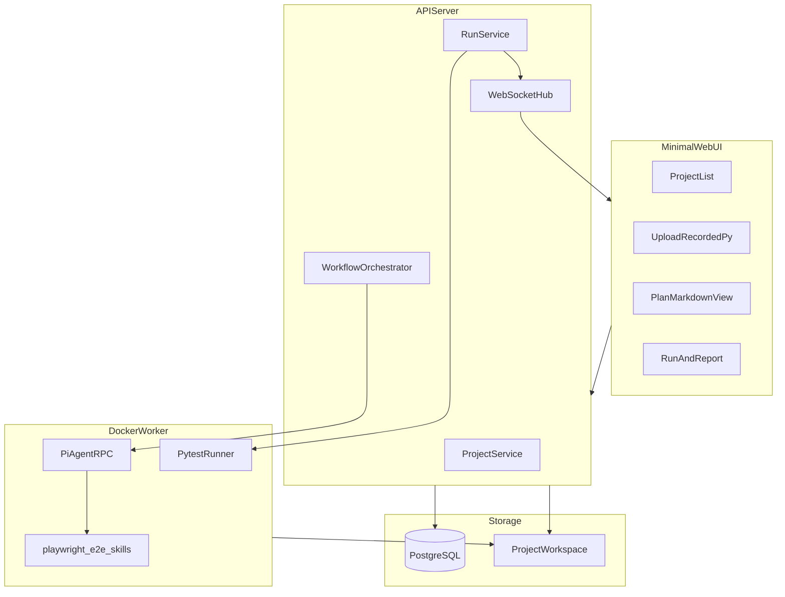

# ai-auto-test-playwright 产品需求文档（PRD）

| 项 | 内容 |
|---|---|
| 版本 | v0.1.0（MVP） |
| 日期 | 2026-09-19 |
| 状态 | **Implemented (MVP v0.1.0)** |
| 实施状态 | [PRD-MVP-Implementation.md §7 完成说明与实现差异](./PRD-MVP-Implementation.md#7-mvp-完成说明--实现差异) |
| 仓库路径 | `ai-auto-test-playwright/` |

---

## 1. 背景与目标

### 1.1 背景

仓库内已有一套在 Cursor IDE 中验证通过的 Playwright E2E 工作流：

- **Skills**：`skills/playwright-e2e/` 下三个 skill（codegen / run-report / fix）
- **样例工程**：根目录 `tests/`（Sauce Demo 15 条 pytest + POM 用例）

该工作流强依赖本地 Cursor + 终端，存在以下局限：

- 无法团队协作与权限隔离
- 测试报告、trace、用例计划无法集中沉淀
- AI 生成过程不可审计、不可复现
- 远程 Agent 无法完成 codegen 人工录制（需本地 GUI）

### 1.2 产品目标

构建 **Web 化 Playwright E2E 自动化平台**，将 Skills 工作流平台化：

```
本地上传录制文件 → AI 生成用例计划 → 人工确认 → 生成 POM 代码 → Worker 执行 → HTML 报告 →（可选）失败修复建议
```

### 1.3 MVP 范围

| 包含 | 不包含 |
|------|--------|
| 后端 API + Docker Worker + 最小 Web UI | Web 内嵌 codegen / noVNC 录制 |
| 上传 `recorded.py` | 多租户 / RBAC |
| Pi Agent RPC 生成计划与代码 | CI/CD 插件 |
| pytest 有头慢速执行 + HTML 报告 | fix 自动改码（MVP 只读建议） |
| WebSocket 实时日志 | 多 Worker 队列 |

### 1.4 关键决策（已确认）

| 决策项 | 选型 |
|--------|------|
| MVP 交付 | API + Docker Worker + 最小 Web UI |
| AI 后端 | Pi Agent RPC（对齐 `ai-auto-test-platform`） |
| 测试栈 | Python pytest-playwright |
| 录制方式 | 本地上传 `recorded.py` |
| 默认执行模式 | 有头 + slowmo（`--headed --slowmo 600`） |

---

## 2. 用户与场景

### 2.1 用户角色

| 角色 | 描述 |
|------|------|
| 测试工程师 | 本地 codegen 录制，Web 上传、确认计划、触发执行 |
| 开发 / Reviewer | 查看生成代码、HTML 报告、trace |
| 平台维护 | Docker 部署、Worker 健康检查、日志排查 |

### 2.2 核心场景

**场景 A：首次接入被测系统**

1. Web 创建项目，填写 `name`、`baseUrl`
2. 初始化 pytest scaffold
3. 本地执行 `npx playwright codegen <URL> --target python-pytest -o recorded/<module>.py`
4. 上传录制文件
5. 一键生成用例计划 → 确认 → 生成代码 → 执行 → 查看报告

**场景 B：迭代用例**

1. 重新上传新的 `recorded.py`
2. 重新生成计划（保留或覆盖）
3. 确认后重新生成代码并回归

**场景 C：失败分析**

1. 执行失败后查看 HTML 报告与 trace
2. 触发 fix/analyze，获取 AI 修复建议（MVP 不自动改码）

---

## 3. 功能需求

功能模块与 `skills/playwright-e2e/cn/` 三个 skill 一一对应。

### 3.1 项目管理

- 创建 / 列表 / 详情 / 更新 / 删除项目
- 字段：`name`、`baseUrl`、`workspacePath`（服务器上的项目工作区绝对路径）
- 路径沙箱：`workspacePath` 必须在 `allowedRepoPrefixes` 配置的白名单内
- 初始化 scaffold：`POST /api/projects/:id/init-template`，非破坏性复制模板（已存在文件不覆盖）
- **单 module 限制（MVP）**：每项目仅支持一个 `moduleName`（如 `saucedemo`），对应一套 `recorded/` + `plans/` + 生成代码。多模块场景请拆分为多个项目；Phase 2 再评估多 module 支持。

### 3.2 录制接入（MVP：上传）

- 上传接口：`POST /api/projects/:id/record/upload`（multipart，`file` + `moduleName`）
- 存储路径：`<workspace>/tests/recorded/<moduleName>.py`
- 校验规则：
  - 文件非空
  - 包含 `playwright` 或 `from playwright` import
  - 扩展名为 `.py`
- UI 展示 codegen 命令指引：
  ```bash
  npx playwright codegen <baseUrl> --target python-pytest -o tests/recorded/<moduleName>.py
  ```

### 3.3 用例计划（playwright-codegen / Pi）

- 触发：`POST /api/projects/:id/plan/generate`，body 可选 `{ "moduleName": "saucedemo" }`
- Pi 读取：`tests/recorded/<module>.py` + skill `playwright-codegen` 计划章节
- 输出：`tests/plans/<module>-test-plan.md`
- 计划必须包含（与 skill 一致）：
  - 录制的流程梳理
  - 页面和 Page Object 规划
  - 数据和造数规划
  - TC 编号用例清单
  - 待确认项
- UI：Markdown 渲染；MVP 提供「确认并生成代码」按钮（在线编辑放 Phase 2）
- 工作流状态更新：`workflow_states.stage = plan`

### 3.4 代码生成（playwright-codegen / Pi）

- 触发：`POST /api/projects/:id/code/generate`，body `{ "moduleName": "saucedemo", "confirmPlan": true }`
- 前置：计划文件存在；`confirmPlan === true`
- Pi 按确认计划生成 POM 工程，目录结构见 [第 11 章 scaffold 规范](#11-project-scaffold-模板规范)
- 生成规范（强制）：
  - 定位器优先 `get_by_role` / `get_by_label` / `get_by_test_id`
  - 站点使用 `data-test` 时在 `conftest.py` 配置 `set_test_id_attribute("data-test")`
  - SPA 导航使用 `wait_until="networkidle"`
  - 用例方法名含 TC 编号，如 `test_tc001_login_success`
  - 随机数据走 data factory
  - 登录态：`fixtures/auth.json` + 自动检测过期并重登
- 工作流状态更新：`workflow_states.stage = code`

### 3.5 执行与报告（playwright-run-report / Docker Worker）

- 触发：`POST /api/projects/:id/run`
- Worker 命令（默认，使用 **Worker 镜像内** `/opt/venv/bin/pytest`，**不依赖** workspace 内 `.venv`）：
  ```bash
  cd <workspace>/tests && /opt/venv/bin/pytest specs/ \
    --headed --slowmo 600 \
    --tracing retain-on-failure \
    --output test-results \
    --html report.html --self-contained-html \
    -v
  ```
- `templates/project-scaffold/requirements.txt` 供本地开发参考；Worker 镜像构建时已预装依赖，不在 workspace 创建 venv。
- 请求参数：

| 字段 | 类型 | 默认 | 说明 |
|------|------|------|------|
| `headed` | boolean | `true` | 有头模式 |
| `slowmo` | number | `600` | 操作间隔 ms，0 表示不减速 |
| `specFilter` | string | null | 可选，如 `specs/test_login.py` |

- 产物：
  - `tests/report.html`
  - `tests/test-results/`（含失败 trace）
  - `tests/.runs/<runId>/run-meta.json`（平台写入：统计、耗时、日志路径）
- 并发：MVP 全局单任务 mutex，运行中返回 409
- WebSocket 事件：`run_started`、`log`、`run_finished`（见 5.3）
- 工作流状态更新：`workflow_states.stage = run`

### 3.6 失败修复（playwright-fix / Pi，MVP 只读）

- 触发：`POST /api/projects/:id/fix/analyze`，body `{ "runId": "..." }`
- Pi 读取：stderr、失败用例名、trace 路径 + skill `playwright-fix`
- 输出：结构化 Markdown 建议（失败用例、根因、修复建议），**不自动修改代码**
- 持久化：`fix_suggestions` 表
- Phase 2：`POST /api/projects/:id/fix/apply` 用户确认后 patch

---

## 4. 系统架构

### 4.1 架构图



### 4.2 Monorepo 目录（实现阶段）

```
ai-auto-test-playwright/
├── PRD.md
├── docker/
│   ├── docker-compose.yml       # server + worker + dashboard + postgres
│   ├── server/Dockerfile      # Node 22 + Pi CLI
│   └── worker/Dockerfile      # Python 3.14 + pytest-playwright + Chromium + Xvfb
├── server/                    # Express 5 + TypeScript
│   ├── src/routes/
│   ├── src/services/
│   ├── src/pi/                # PiRpcClient（参考 ai-auto-test-platform）
│   └── src/ws/
├── dashboard/                 # Vite + React + Tailwind
├── worker/
│   ├── run-pytest.sh          # Worker 入口脚本
│   └── healthcheck.sh
├── templates/project-scaffold/
└── skills/                    # 复制或软链 ../skills/playwright-e2e/cn
```

### 4.3 组件职责

| 组件 | 职责 |
|------|------|
| **API Server** | REST API、Pi RPC 编排、WebSocket 广播、DB 持久化 |
| **Docker Worker** | 隔离环境执行 pytest；挂载项目工作区；Xvfb 支持有头模式 |
| **Dashboard** | 最小 Web UI；nginx 反代 `/api`、`/ws` |
| **PostgreSQL** | 项目、工作流状态、运行历史、修复建议 |
| **文件系统** | 项目工作区：`/data/projects/<projectId>/tests/` |

### 4.4 Pi Agent 集成

- 模式：`pi --mode rpc`（JSONL stdin/stdout），复用 `ai-auto-test-platform/test-server/src/pi/rpc-client.ts` 模式
- Skills 挂载路径：容器内 `/root/.pi/agent/skills/`
  - `playwright-codegen/SKILL.md`
  - `playwright-run-report/SKILL.md`
  - `playwright-fix/SKILL.md`
- Prompt 模板：
  - `plan-prompt.ts` — 读取 recorded + 输出 plan markdown
  - `code-prompt.ts` — 读取 plan + 生成 POM 文件
  - `fix-prompt.ts` — 读取 run 失败信息 + 输出建议

### 4.5 Docker Worker 设计

**镜像内容：**

- Python 3.14 + 固定 venv 路径 `/opt/venv`（内置 pytest、pytest-playwright、pytest-html、playwright）
- `playwright install chromium`
- Xvfb（有头模式在无 DISPLAY 的 Linux 容器内使用）
- **不依赖** project workspace 内的 `.venv`；`run-pytest.sh` 始终调用 `/opt/venv/bin/pytest`

**执行流程：**

1. API `RunService` 写入 run job 元数据，调用 Worker HTTP `POST /internal/run` 或 `docker exec`
2. Worker 在挂载目录执行 `run-pytest.sh`
3. stdout/stderr 流式回传 API → WebSocket
4. 完成后 Worker 回调或 API 轮询 run 状态

**MVP 简化：** server 与 worker 可在同一 compose 网络内，server 通过 HTTP 调用 worker:8081/run；单 Worker 单任务锁。

---

## 5. API 规格

Base URL: `http://localhost:3001`（开发） / nginx 反代 `/api`（生产）

### 5.1 通用约定

**响应包装：**

```json
{
  "ok": true,
  "data": { }
}
```

**错误响应：**

```json
{
  "ok": false,
  "error": {
    "code": "RUN_IN_PROGRESS",
    "message": "Another run is already in progress"
  }
}
```

| HTTP | code | 说明 |
|------|------|------|
| 409 | `RUN_IN_PROGRESS` | 已有运行中任务 |
| 422 | `MISSING_RECORDED` | 无录制文件 |
| 422 | `MISSING_PLAN` | 无计划或未确认 |
| 422 | `INVALID_WORKSPACE` | 路径不在白名单 |
| 422 | `PI_JOB_FAILED` | Pi plan/code/fix job 失败（见 `jobs.error`） |
| 504 | `PI_JOB_TIMEOUT` | Pi job 超时（`RUN_TIMEOUT_MS`） |
| 409 | `JOB_ALREADY_RUNNING` | 同类型 job 已在运行 |
| 503 | `WORKER_UNAVAILABLE` | Worker 不可达 |

### 5.2 REST 端点一览

| Method | Path | 说明 |
|--------|------|------|
| GET | `/health` | 服务 + DB + Worker 状态 |
| GET | `/api/projects` | 项目列表 |
| POST | `/api/projects` | 创建项目 |
| GET | `/api/projects/:id` | 项目详情 |
| PUT | `/api/projects/:id` | 更新项目 |
| DELETE | `/api/projects/:id` | 删除项目 |
| POST | `/api/projects/:id/init-template` | 初始化 scaffold |
| POST | `/api/projects/:id/record/upload` | 上传 recorded.py |
| POST | `/api/projects/:id/plan/generate` | Pi 生成计划 |
| GET | `/api/projects/:id/plan` | 获取计划 Markdown |
| POST | `/api/projects/:id/code/generate` | Pi 生成代码 |
| GET | `/api/projects/:id/files` | 代码树 |
| GET | `/api/projects/:id/workflow` | 工作流状态 |
| POST | `/api/projects/:id/run` | 触发 pytest |
| GET | `/api/projects/:id/runs` | 运行历史 |
| GET | `/api/projects/:id/runs/:runId` | 单次运行详情 |
| GET | `/api/projects/:id/runs/:runId/report` | HTML 报告（Content-Type: text/html） |
| GET | `/api/projects/:id/runs/:runId/traces/:name` | trace.zip 下载 |
| POST | `/api/projects/:id/fix/analyze` | 失败分析 |
| GET | `/api/jobs/:jobId` | 异步 job 状态（plan/code/fix/run） |
| POST | `/api/jobs/:jobId/cancel` | 取消 pending/running 的 Pi job（run 发 SIGTERM） |
| WS | `/ws` | 实时日志 |

### 5.3 WebSocket 消息

```typescript
type WsMessage =
  | { type: "run_started"; runId: string; projectId: string; jobId?: string }
  | { type: "log"; runId: string; line: string }
  | { type: "run_finished"; runId: string; passed: number; failed: number; skipped: number; durationMs: number }
  | { type: "plan_generating"; projectId: string; jobId: string }
  | { type: "plan_ready"; projectId: string; planPath: string; jobId: string }
  | { type: "plan_failed"; projectId: string; jobId: string; error: string }
  | { type: "code_generating"; projectId: string; jobId: string }
  | { type: "code_ready"; projectId: string; jobId: string }
  | { type: "code_failed"; projectId: string; jobId: string; error: string }
  | { type: "fix_failed"; projectId: string; jobId: string; error: string };
```

**Pi job 失败时：** `POST plan/generate` 等仍返回 202；客户端通过 `GET /api/jobs/:jobId` 或 WS `*_failed` 获取 `status: failed` 与 `error` 详情。MVP 不支持 Pi job 自动重试（Phase 3 队列层最多 1 次 retry）。

### 5.4 API 请求/响应示例

#### POST /api/projects — 创建项目

**Request:**

```json
{
  "name": "Sauce Demo",
  "baseUrl": "https://www.saucedemo.com",
  "workspacePath": "/data/projects/saucedemo"
}
```

**Response 201:**

```json
{
  "ok": true,
  "data": {
    "id": "proj_01HXYZ",
    "name": "Sauce Demo",
    "baseUrl": "https://www.saucedemo.com",
    "workspacePath": "/data/projects/saucedemo",
    "status": "created",
    "workflowStage": "init",
    "createdAt": "2026-09-19T09:00:00.000Z"
  }
}
```

#### POST /api/projects/:id/record/upload — 上传录制

**Request:** `multipart/form-data`

| 字段 | 说明 |
|------|------|
| `file` | recorded.py 文件 |
| `moduleName` | 模块名，如 `saucedemo` |

**Response 200:**

```json
{
  "ok": true,
  "data": {
    "moduleName": "saucedemo",
    "path": "tests/recorded/saucedemo.py",
    "sizeBytes": 639,
    "workflowStage": "recorded"
  }
}
```

#### POST /api/projects/:id/plan/generate — 生成用例计划

**Request:**

```json
{
  "moduleName": "saucedemo"
}
```

**Response 202**（异步，Pi 生成中）:

```json
{
  "ok": true,
  "data": {
    "jobId": "plan_01HXYZ",
    "status": "running",
    "message": "Pi agent is generating test plan"
  }
}
```

**完成后 GET /api/projects/:id/plan Response 200:**

```json
{
  "ok": true,
  "data": {
    "moduleName": "saucedemo",
    "path": "tests/plans/saucedemo-test-plan.md",
    "content": "# Sauce Demo 用例计划\n\n...",
    "workflowStage": "plan",
    "generatedAt": "2026-09-19T09:05:00.000Z"
  }
}
```

#### POST /api/projects/:id/code/generate — 生成代码

**Request:**

```json
{
  "moduleName": "saucedemo",
  "confirmPlan": true
}
```

**Response 202:**

```json
{
  "ok": true,
  "data": {
    "jobId": "code_01HXYZ",
    "status": "running"
  }
}
```

**完成后 GET /api/projects/:id/files Response 200:**

```json
{
  "ok": true,
  "data": {
    "workflowStage": "code",
    "files": [
      "tests/conftest.py",
      "tests/pytest.ini",
      "tests/requirements.txt",
      "tests/specs/test_login.py",
      "tests/specs/test_inventory.py",
      "tests/pages/login_page.py",
      "tests/data/user_factory.py"
    ]
  }
}
```

#### POST /api/projects/:id/run — 执行测试

**Request:**

```json
{
  "headed": true,
  "slowmo": 600,
  "specFilter": null
}
```

**Response 202:**

```json
{
  "ok": true,
  "data": {
    "runId": "run_01HXYZ",
    "status": "running"
  }
}
```

**GET /api/projects/:id/runs/:runId Response 200:**

```json
{
  "ok": true,
  "data": {
    "runId": "run_01HXYZ",
    "status": "passed",
    "passed": 15,
    "failed": 0,
    "skipped": 0,
    "durationMs": 72460,
    "reportUrl": "/api/projects/proj_01HXYZ/runs/run_01HXYZ/report",
    "headed": true,
    "slowmo": 600,
    "finishedAt": "2026-09-19T09:15:00.000Z"
  }
}
```

#### POST /api/projects/:id/fix/analyze — 失败分析

**Request:**

```json
{
  "runId": "run_01HABC"
}
```

**Response 200:**

```json
{
  "ok": true,
  "data": {
    "runId": "run_01HABC",
    "failingTests": [
      {
        "tc": "TC-007",
        "nodeId": "specs/test_inventory.py::TestInventory::test_tc007_view_product_detail",
        "error": "strict mode violation: locator(\".inventory_details\") resolved to 2 elements"
      }
    ],
    "analysis": "## 根因判断\n\n定位器 `.inventory_details` 同时匹配 header 与 div...\n\n## 修复建议\n\n改为 `div.inventory_details`...",
    "tracePaths": [
      "tests/test-results/specs-test_inventory-py-test_tc007-chromium/trace.zip"
    ]
  }
}
```

#### GET /health

**Response 200:**

```json
{
  "ok": true,
  "data": {
    "server": "up",
    "database": "up",
    "worker": "up",
    "activeRun": null,
    "projectCount": 3
  }
}
```

---

## 6. 数据模型

### 6.1 ER 关系

```mermaid
erDiagram
    projects ||--o| workflow_states : has
    projects ||--o{ jobs : has
    projects ||--o{ runs : has
    runs ||--o{ fix_suggestions : has
    jobs ||--o| runs : may_create

    projects {
        uuid id PK
        string name
        string base_url
        string workspace_path
        string status
        timestamptz created_at
        timestamptz updated_at
    }

    workflow_states {
        uuid project_id PK_FK
        string stage
        string stage_status
        string module_name
        jsonb artifact_paths
        timestamptz updated_at
    }

    jobs {
        uuid id PK
        uuid project_id FK
        string type
        string status
        text error
        jsonb result
        timestamptz started_at
        timestamptz finished_at
    }

    runs {
        uuid id PK
        uuid project_id FK
        uuid job_id FK
        string status
        int passed
        int failed
        int skipped
        int duration_ms
        string report_path
        string log_path
        jsonb options
        timestamptz started_at
        timestamptz finished_at
    }

    fix_suggestions {
        uuid id PK
        uuid run_id FK
        text analysis_md
        jsonb failing_tests
        timestamptz created_at
    }
```

### 6.2 字段说明

**projects.status：** `created` | `active` | `archived`

**workflow_states.stage：** `init` | `recorded` | `plan` | `code` | `run`

**workflow_states.stage_status：** `idle` | `generating` | `running` | `failed` — 表示当前 stage 下是否有进行中的 job；UI 据此 disable 按钮（也可直接查 `jobs` 表）

**jobs.type：** `plan` | `code` | `fix` | `run`

**jobs.status：** `pending` | `running` | `completed` | `failed` | `cancelled`

**jobs.result：** 完成时写入，如 `{ "runId": "..." }`、`{ "planPath": "..." }`

**runs.status：** `pending` | `running` | `passed` | `failed` | `cancelled`

**runs.options：** `{ "headed": true, "slowmo": 600, "specFilter": null }`

### 6.3 迁移脚本（MVP）

`server/migrations/001_init.sql`（5 张表）：

- `projects`
- `workflow_states`（含 `stage_status`）
- `jobs`
- `runs`（含可选 `job_id` FK）
- `fix_suggestions`

**jobs 表（MVP 必含，Phase 3 队列复用）：**

```sql
CREATE TABLE jobs (
  id UUID PRIMARY KEY DEFAULT gen_random_uuid(),
  project_id UUID NOT NULL REFERENCES projects(id) ON DELETE CASCADE,
  type TEXT NOT NULL CHECK (type IN ('plan', 'code', 'fix', 'run')),
  status TEXT NOT NULL DEFAULT 'pending'
    CHECK (status IN ('pending', 'running', 'completed', 'failed', 'cancelled')),
  error TEXT,
  result JSONB,
  started_at TIMESTAMPTZ,
  finished_at TIMESTAMPTZ,
  created_at TIMESTAMPTZ NOT NULL DEFAULT now()
);
CREATE INDEX idx_jobs_project_status ON jobs(project_id, status);
```

---

## 7. 最小 Web UI

### 7.1 页面清单

| 路由 | 页面 | 功能 |
|------|------|------|
| `/projects` | 项目列表 | 新建、列表、跳转详情 |
| `/projects/:id` | 项目概览 | 当前 workflow stage、快捷操作按钮 |
| `/projects/:id/record` | 录制上传 | 上传 recorded.py；展示 codegen 命令 |
| `/projects/:id/plan` | 用例计划 | Markdown 渲染；「确认并生成代码」 |
| `/projects/:id/code` | 代码浏览 | 文件树 + 只读代码预览 |
| `/projects/:id/run` | 执行 | headed/slowmo 选项；WebSocket 终端 |
| `/projects/:id/report/:runId` | 报告 | iframe 嵌入 report.html；trace 下载链接 |

> MVP 实现说明（含部分交付项）：见 [PRD-MVP-Implementation.md §7](./PRD-MVP-Implementation.md#7-mvp-完成说明--实现差异)。

### 7.2 技术栈

- Vite 6 + React 19 + Tailwind 4（对齐 `ai-auto-test-platform/test-dashboard`）
- nginx 反代：`/api/*`、`/ws`、`/health`
- WebSocket Hook：`useRunWebSocket`（参考 platform）

### 7.3 工作流状态机（UI 侧）

```
init → recorded → plan → code → run
         ↑          ↑       ↑
      上传录制    生成计划  生成代码
```

每个 stage 配合 `stage_status`（或查询活跃 `jobs`）：`generating` / `running` 时禁用冲突操作按钮。

按钮可用性：

| Stage | 可用操作 |
|-------|----------|
| init | init-template、上传录制 |
| recorded | 生成计划 |
| plan | 确认并生成代码 |
| code | 执行测试 |
| run | 重新上传 / 重新生成 / 再执行 / fix 分析 |

> Tab 按 stage 禁用、Record 页 codegen 命令区等 UI polish 项：MVP **部分实现**，详见 [PRD-MVP-Implementation.md §7](./PRD-MVP-Implementation.md#7-mvp-完成说明--实现差异)。

---

## 8. 非功能需求

| 项 | 要求 |
|----|------|
| 性能 | 15 条用例 headless CI 模式 < 3 分钟 |
| 性能 | 15 条用例 headed slowmo 600 < 120 秒（理想网络条件；实测约 72–90s） |
| 资源 | Worker 容器内存 >= 2GB（Chromium + Python） |
| 安全 | workspacePath 白名单；上传文件大小 <= 1MB |
| 安全 | 无 SSRF：baseUrl 仅用于文档展示，Worker 不代请求任意 URL |
| 可用性 | Docker Compose 一键启动 |
| 日志 | 运行日志保留 30 天（可配置） |
| 可观测 | `/health` 暴露 server / db / worker 状态 |

---

## 9. MVP 验收标准

1. `docker compose up` 启动 server、worker、dashboard、postgres 全部 healthy
2. Web 创建项目（Sauce Demo，`baseUrl=https://www.saucedemo.com`）
3. init-template 生成空 scaffold
4. 上传 `tests/recorded/saucedemo.py`（仓库样例）
5. Pi 生成计划，UI 展示 Markdown
6. 确认后 Pi 生成 POM 代码，目录结构与根目录 `tests/` 样例一致
7. Web 触发 headed slowmo 执行，15 passed
8. UI 可打开 HTML 报告
9. 人为制造失败后，fix/analyze 返回结构化建议（不自动改码）

---

## 10. 分期路线图

| 阶段 | 内容 | 预估 |
|------|------|------|
| **MVP** | API + Worker + 最小 UI + 上传录制 + Pi 计划/代码 + pytest 报告 + fix 只读 | 4–6 周 |
| Phase 2 | 计划在线编辑；fix/apply 确认改码；headless CI 模式切换 | 2–3 周 |
| Phase 3 | noVNC Web 录制；Redis 任务队列 + 多 Worker；Git 集成；CI；RBAC（详见 [PRD-Phase3.md](./PRD-Phase3.md)） | 4–6 周 |

---

## 11. project-scaffold 模板规范

初始化模板目录：`templates/project-scaffold/`，复制到 `<workspace>/tests/`（copy-if-missing）。

### 11.1 目录结构

```
tests/
├── conftest.py              # pytest fixture；auth 自动检测/重登；data-test 配置
├── pytest.ini               # pythonpath、testpaths=specs
├── requirements.txt         # pytest、pytest-playwright、pytest-html
├── .gitignore               # .venv、auth.json、report.html、test-results
├── specs/                   # 用例层（AI 生成，初始为空）
│   └── .gitkeep
├── pages/                   # Page Object（AI 生成，初始为空）
│   └── .gitkeep
├── data/                    # 数据工厂（AI 生成，初始为空）
│   └── .gitkeep
├── helpers/
│   └── trace_support.py     # trace 路径工具
├── fixtures/
│   └── .gitkeep             # auth.json 运行时生成，不提交
├── plans/                   # 用例计划（AI 生成）
│   └── .gitkeep
└── recorded/                # codegen 原始录制（用户上传）
    └── .gitkeep
```

### 11.2 模板文件清单

| 文件 | 来源参考 | 占位符 | 说明 |
|------|----------|--------|------|
| `conftest.py` | 根目录 `tests/conftest.py` | `__BASE_URL__` | 含 `ensure_auth_file`、`logged_in_page`、`set_test_id_attribute` |
| `pytest.ini` | 根目录 `tests/pytest.ini` | 无 | `pythonpath = .`，`testpaths = specs` |
| `requirements.txt` | 根目录 `tests/requirements.txt` | 无 | 固定版本范围 |
| `.gitignore` | 根目录 `tests/.gitignore` | 无 | 忽略 venv、auth、报告 |
| `helpers/trace_support.py` | 根目录 `tests/helpers/trace_support.py` | 无 | trace 路径 helper |
| `specs/.gitkeep` | — | — | 占位 |
| `pages/.gitkeep` | — | — | 占位 |
| `data/.gitkeep` | — | — | 占位 |
| `fixtures/.gitkeep` | — | — | 占位 |
| `plans/.gitkeep` | — | — | 占位 |
| `recorded/.gitkeep` | — | — | 占位 |

### 11.3 conftest.py 必须包含的能力

以下能力已在样例工程验证，scaffold 必须内置：

1. **`configure_test_id_attribute`** — `playwright.selectors.set_test_id_attribute("data-test")`
2. **`ensure_auth_file`** — 检测 `fixtures/auth.json` 有效性，无效则自动登录重建
3. **`logged_in_page`** — 带 storage_state 的 fixture；跳转失败时 force 重登
4. **`LoginPage.goto`** — `wait_until="networkidle"` 等待 SPA 渲染

### 11.4 AI 生成代码目录（非 scaffold，由 Pi 写入）

参考根目录 `tests/` 完整样例（Sauce Demo 15 用例）：

| 目录/文件 | 生成规则 |
|-----------|----------|
| `specs/test_<module>.py` | 类名 `Test<Xxx>`，方法 `test_tcNNN_<name>` |
| `pages/<name>_page.py` | 每页面一个 class，含 `assert_loaded` |
| `data/<name>_factory.py` | 随机数据工厂，禁止硬编码 |
| `plans/<module>-test-plan.md` | Pi 计划输出 |
| `recorded/<module>.py` | 用户上传，AI 不得修改 |

### 11.5 模板变量替换

| 变量 | 替换时机 | 示例 |
|------|----------|------|
| `__BASE_URL__` | init-template / 创建项目 | `https://www.saucedemo.com` |

---

## 12. 风险与依赖

| 风险 | 影响 | 缓解 |
|------|------|------|
| Pi RPC 依赖 LLM 网关 | 计划/代码生成不可用 | 复用 platform Higress 配置；entrypoint 渲染 Pi config |
| 有头模式在 Linux 容器无 DISPLAY | headed 执行失败 | Worker 镜像内置 Xvfb；启动前 `xvfb-run` |
| `data-test` vs `data-testid` | 定位器全部超时 | scaffold 默认配置 test id attribute |
| 登录态 auth.json 过期 | 用例卡在登录页 | conftest 自动检测并重登 |
| 单 Worker mutex | 并发执行阻塞 | MVP 可接受；Phase 3 队列 |
| 上传录制质量差 | AI 计划/代码质量差 | UI 提供录制指引；计划待确认项 |

**外部依赖：**

- `ai-auto-test-platform` — Pi RPC、WebSocket、Docker 模式参考
- `skills/playwright-e2e/cn/` — Agent skill 源
- 根目录 `tests/` — 样例工程与 scaffold 参考实现

---

## 13. 参考资产

| 资产 | 路径 |
|------|------|
| Playwright E2E Skills（中文） | `skills/playwright-e2e/cn/` |
| Sauce Demo 样例工程 | `tests/` |
| BDD 平台参考实现 | `ai-auto-test-platform/test-server/` |
| Pi RPC Client | `ai-auto-test-platform/test-server/src/pi/rpc-client.ts` |
| WebSocket Hub | `ai-auto-test-platform/test-server/src/ws/ws-hub.ts` |
| Run Service 模式 | `ai-auto-test-platform/test-server/src/services/run-service.ts` |

---

## 14. 技术决策记录（ADR）

| ID | 决策 | 理由 | 日期 |
|----|------|------|------|
| ADR-001 | MVP 采用上传录制而非 Web codegen | 实现成本低；录制质量可控 | 2026-09-19 |
| ADR-002 | AI 使用 Pi RPC 而非直接 LLM API | 与现有 platform 一致；skills 可复用 | 2026-09-19 |
| ADR-003 | 测试栈选 pytest-playwright | 与 skills 和样例工程一致 | 2026-09-19 |
| ADR-004 | 默认 headed + slowmo 600 | 用户需观察执行过程 | 2026-09-19 |
| ADR-005 | MVP fix 只读建议 | 避免 AI 擅自改码；对齐 skill 原则 | 2026-09-19 |
| ADR-006 | 单 Worker 单任务 mutex | 简化 MVP；对齐 platform RunService | 2026-09-19 |
| ADR-007 | MVP 引入 jobs 表 | 统一 plan/code/fix/run 异步模型；Phase 3 队列复用 | 2026-09-19 |
| ADR-008 | Worker 用镜像 /opt/venv pytest | 不依赖 workspace .venv；scaffold requirements 仅文档 | 2026-09-19 |
| ADR-009 | MVP 每项目单 module | 降低 workflow 复杂度；多模块拆项目 | 2026-09-19 |

---

## 附录 A：与 ai-auto-test-platform 差异对照

| 维度 | ai-auto-test-platform | ai-auto-test-playwright |
|------|----------------------|-------------------------|
| 测试语言 | TypeScript | Python |
| 测试框架 | Playwright Test CLI | pytest-playwright |
| 用例来源 | BDD Gherkin 审计 | Codegen 录制 + AI 计划 |
| 特性存储 | FEATURES.json + Postgres | plans/*.md + workflow_states |
| Agent 目标 | 写 `tests/e2e/*.spec.ts` | 写 POM pytest 工程 |
| Step 跟踪 | GherkinStepTracker | pytest stdout 日志 |

---

## 附录 B：环境变量（MVP）

| 变量 | 默认值 | 说明 |
|------|--------|------|
| `PORT` | `3001` | API Server 端口 |
| `DATABASE_URL` | — | PostgreSQL 连接串 |
| `WORKER_URL` | `http://worker:8081` | Worker 内部地址 |
| `ALLOWED_REPO_PREFIXES` | `/data/projects` | 工作区白名单 |
| `PI_LLM_GATEWAY` | — | Pi LLM 网关（参考 platform） |
| `RUN_TIMEOUT_MS` | `600000` | 单次 pytest 超时 10 分钟 |
| `DASHBOARD_PORT` | `8040` | Web UI 端口 |
